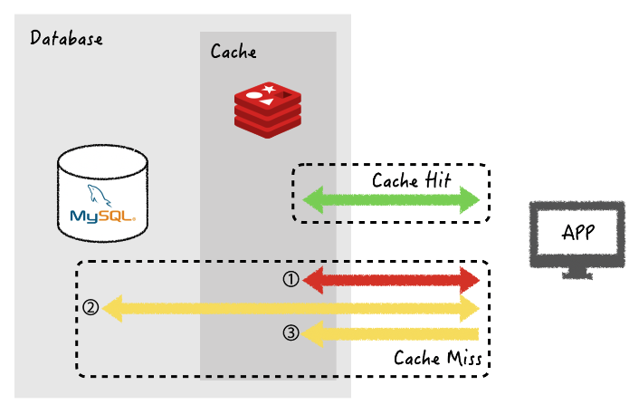
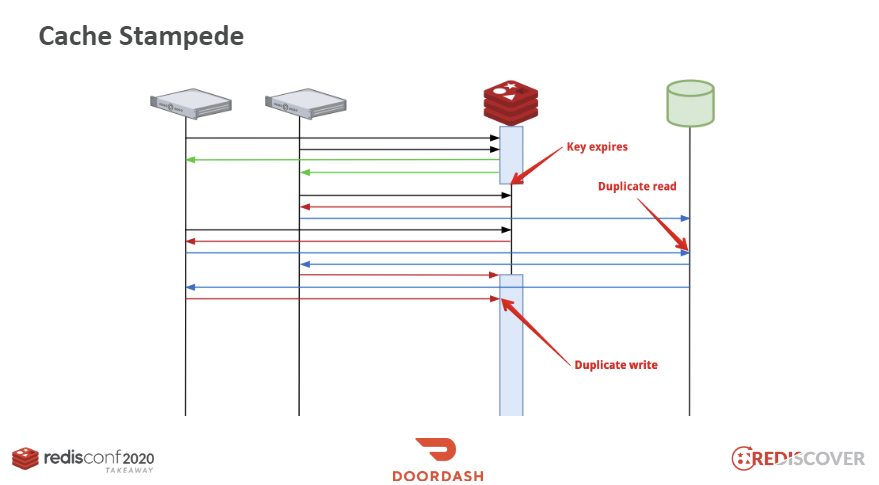

## Redis Cache 전략

캐싱 전략은 웹 서비스 환경에서 성능 향상을 기대할 수 있는 중요한 기술이다.

캐시는 일반적으로 RAM 메모리를 활용하기 때문에 DB보다 훨씬 빠르게 데이터를 응답할 수 있다. \
하지만 RAM 용량이 보통 16~32G 수준이라 데이터를 무분별하게 저장하면 용량 부족이 일어날 수 있다.

즉, 어떤 데이터를 저장할지 얼마나 오래 저정할지, 어떻게 삭제할지에 대한 '**지침 전략**'을 제대로 세워야 한다.

### 캐싱 전략 
캐시를 이용하게 되면 반드시 마주하는 문제점이 데이터의 **정합성**이다.

캐시에서의 데이터와 데이터베이스에서의 데이터가 같지 않다면 정보의 불일치가 발생할 수 있다.

따라서 적절한 **캐시 읽기 전략**과 **쓰기 전략**을 통해 정합성을 보장해줄 필요가 있다.

    

### 읽기 전략 (Read Cache Strategy)

### Look Aside 패턴

- 데이터를 찾을 때 캐시 우선으로 확인 -> 데이터가 없으면 DB 조회
- 반복적인 읽기에 적합함
- 원하는 데이터를 선별해서 캐시에 저장
- DB와 분리되어 가용하기 때문에 장애 발생시에도 대응 가능하다.

Look Aside 패턴은 가장 일반적으로 사용되는 전략이다. 

이 방식은 캐시에 장애가 발생하더라도 DB에 요청을 전달하므로 대기가 쉽지만 , \
정합성 유지에 문제가 발생할 수 있고, 최초에 데이터 조회시에는 반드시 DB에 접근하기 때문에  
단건 조회 호출이 많은 데이터보단 반복적으로 동일 쿼리를 수행하는 요소에 적합하다.

> ### [Cache Warming]
> 미리 캐시로 DB의 데이터를 넣어두어 갑작스런 트래픽 급증시에 \
> 대량의 cache miss 가 발생하여 DB의 부하가 높아지는 것을 방지할 수 있다.

### Read Through

- 캐시에서만 데이터를 읽어오는 전략
- 데이터 조회를 캐시에만 의지하므로 속도가 느리고 장애에 대응하기 어렵다.
- 항상 데이터 동기화를 이루기 때문에 정합성은 보장한다.

### 쓰기 전략 (Write Cache Strategy)

### Write Through
- 데이터베이스와 캐시에 동시에 데이터를 저장하는 방식
- 캐시에 먼저 저장하고 데이터베이스에 저장
- DB와의 동기화 작업을 캐시에 위힘
- 캐시는 항상 최신의 상태 유지, 데이터 일관성 유지
- 불필요한 리소스 저장이 발생할 수 있고 쓰기 작업이 2번 진행되어 성능 이슈 가능성

항상 동기화된 최신 정보를 가지고 있지만 매번 2번의 쓰기 작업을 통하기 때문에 상대적으로 느리다.

### Write Around

- Write Through 전략보다 빠르다
- 모든 데이터를 DB에 저장 
- Cache miss 가 발생하는 경우에만 캐시에 데이터 저장
- 정합성에서 문제가 발생할 수 있다.

해당 전략은 속도는 빠르지만 cache miss 가 발생하기전 DB 데이터의 변화가 발생하면 \
정합성을 보장할 수 없기 때문에 적절한 만료 전략을 설정해서 정합성을 높혀야 한다.

### 캐시의 저장 방식 지침

캐시는 **자주 사용되면서 자주 변경되지 않는 데이터**를 캐싱하면 높은 성능 향상을 이뤄낼 수 있다.
이를 **Cache Hit Rating** 이라고 한다.

일반적으로 캐시는 메모리에 저장되기 때문에 제약적인 저장 공간을 사용한다. \
따라서 데이터가 너무 많이 쌓이게 되면 서비스 전체에 문제가 발생할 수 있다.

또한 캐시에 저장되는 데이터는 언제든 날라갈 수도 있는 휘발성을 가지게 된다. \
중요한 데이터나 영구적으로 저장해야할 데이터를 캐시에 저장하는 것은 위험하다.

### 캐시의 삭제 방식 지침

캐시는 기본적으로 단독으로 사용되는 저장소가 아니라 영구적으로 저장한 데이터의 복사본의 역할을 한다. \
제한적인 저장소에 복사본이 영구적으로 보관된다면 데이터의 최신화가 되지 않고, 저장공간이 부족해 질 수 있다.

따라서 캐시를 저장할 때는 **기본 만료 정책**을 설정해야 한다.

저장된 캐시 데이터는 기간이 만료되면 삭제되고, 새롭게 업데이트된 데이터를 다시 저장한다. \
하지만 만료 주기가 너무 짧아지면 Cache Stampede 현상이 발생할 수도 있으니 적절한 시간을 설정해야한다.

### Cache Stampede

    

대규모 트래픽 환경에서 TTL 값이 너무 작게 설정되면 cache stampede 현상이 발생할 수 있다.

1. 레디스 정보가 만료되는 순간 많은 서버에서 해당 데이터를 동시에 조회할 때 
2. 중복적으로 DB에서 데이터를 조회해서 갑자기 부하가 발생한다.
3. 또 읽어온 값을 중복적으로 redis에 작생해서 불필요한 정보가 늘어날 수 있다.

