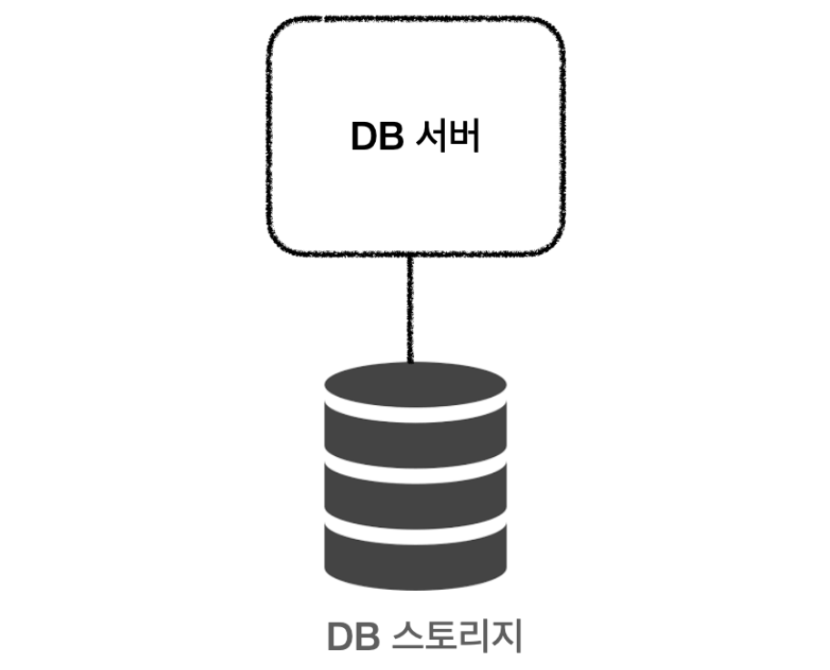
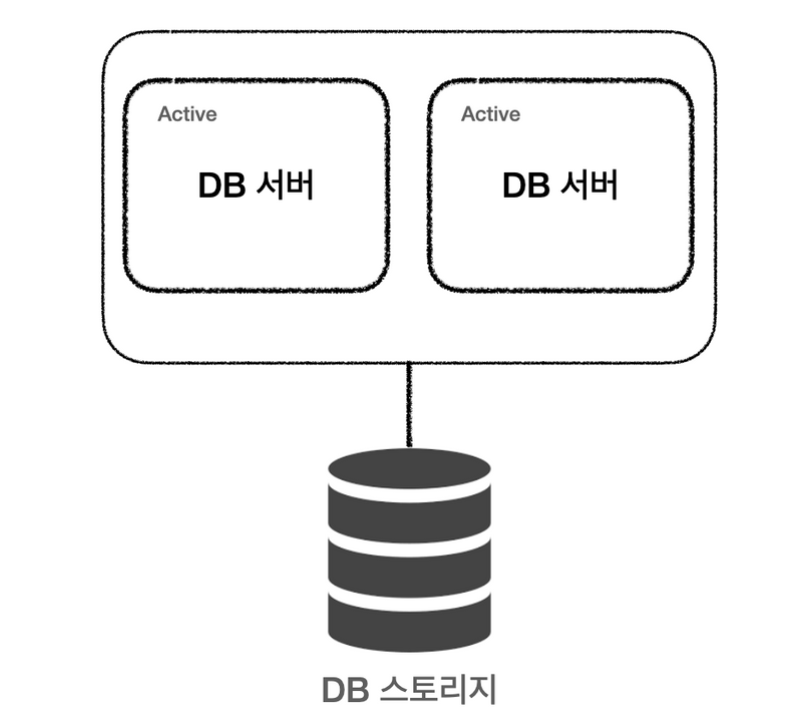
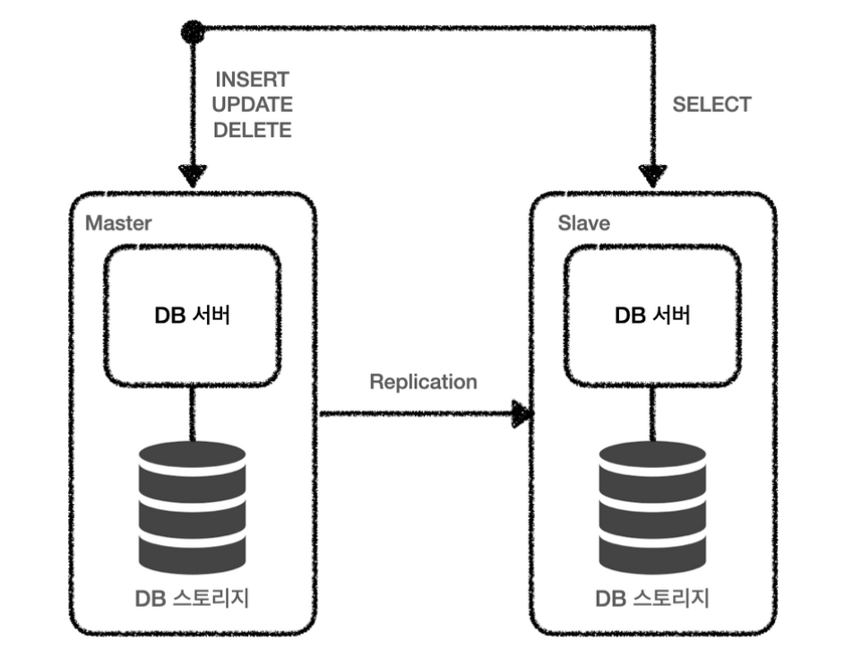
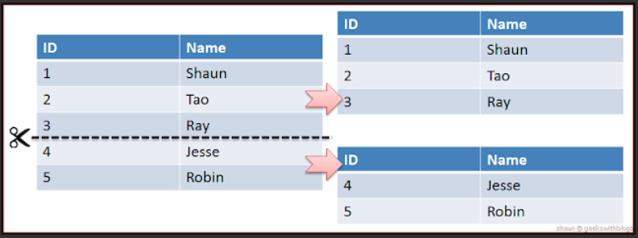
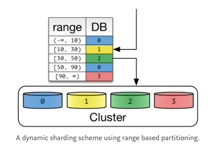

## 데이터 베이스의 확장

    

일반적으로 데이터베이스는 하나의 서버, 하나의 스토리지를 가진다.

하지만 서비스가 성장하고 데이터가 쌓임에 따라 발생할 수 있는 여러가지 문제들이 있는데,

오늘은 이런 문제들을 해결할 수 있는 방법에 대해 정리해보겠다.

### Clustering

하나의 서버를 가지고 있을 때 만약 해당 서버가 다운되면 모든 서비스가 멈추게 될 것이다. \
이것을 방지하기 위해 서버를 여러개로 만들어 관리하는 것을 클러스터링이라고 한다.

- 수평적인 여러개의 DB 서버
- Single point of failure 방지
- 동기 방식으로 노드간의 데이터 동기화

> **single point of failure(단일 장애점,SPOF)**
>
> 시스템 구성 요소 중에서, 동작하지 않으면 전체 시스템이 중단되는 요소
> 이중화가 되어 있지 않은 요소라면 SPOF일 가능성 높음

> **Fail over**
>
> 실 운용환경(컴퓨터 서버, 시스템, 네트워크) 등에서 이상이 생겼을 때, 대체 작동 또는 장애 극복(조치)을 위해 예비 운용환경으로 자동전환되는 기능

### Active & Active

    

- 서버 한대가 죽더라도 나머지 서버가 동작해서 문제 x
- 부하가 나눠지기 때문에 서버에 CPU, Memory 부하도 줄어든다.
- 여러대의 서버가 하나의 스토리지를 공유하기 때문에 병목현상 가능성

### Active & Stand By

    

- Active 상태의 서버가 죽었을 때 Fail over 하여 Stand-By 서버를 Active로 전환
- Fail over 시에 잠깐의 서버스 중단 발생

### Replication

서비스가 성장하며 트래픽이 증가하는데 하나의 DB 서버가 모두 감당하기에는 무리가 있다. \
특히 단순 조회의 비율이 높은 경우 저장소를 복제하여 쓰기 연산과 읽기 연산의 요청을 분리할 수 있다.

    

- 여러개의 DB를 수직적인 구조로 구축 (Master - Slave)
- Slave 서버를 여러개 구축해서 읽기 연산을 분산할 수 있다.
- 일관성 있는 데이터 유지를 위해 동기화에 신경써야 한다.

### Sharding

데이터가 너무 많이 쌓여서 간단한 조회도 느려진다면 동일한 스키마를 가지는 테이블을 여러개로 나눌수도 있습니다.

    

- 같은 스키마를 가지는 데이터를 다수의 DB에 나누어 저장
- DB를 결정하는 유일한 식별자가 필요하다.

### Sharding Key 결정 방식

#### Hash Sharding 

    

- 샤딩 키를 모듈러 연산을 통해서 나눈다.
- 구현이 간단하다.
- 샤드의 갯수가 변하면 데이터를 재정렬 해야한다.
- 데이터의 양이 일정하게 유지될 때 유용하다. -> 24시간만 유지되는 데이터 저장

#### Range Sharding

    

- 샤딩 키의 범위를 지정해 나눈다.
- 확장에 용이하다.
- 특정 샤드에 요청이 몰릴 수 있다.
  - ex) 게시판의 경우 최신 글의 요청이 많고 초반부의 글은 거의 요청하지 않는다.
  - 데이터를 적절히 재배치할 수 도 있어야 한다. 
