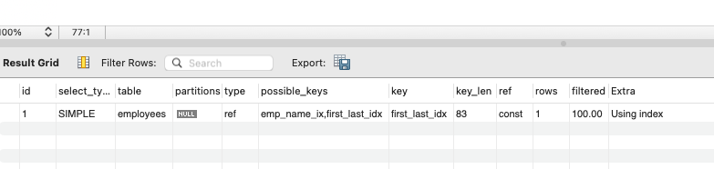
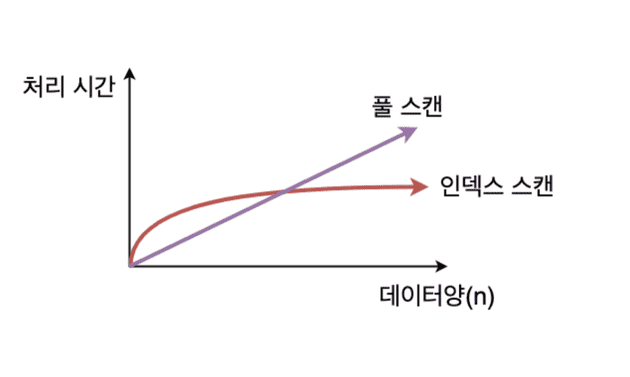

## 인덱스 (Index)
추가적인 쓰기 작업과 저장 공간을 활용하여 데이터베이스 테이블의 **검색 속도를 향상**시키기 위한 자료구조 \ 
=> 특정 조건으로 정렬된 데이터의 주소값을 저장하는 자료구조. 원하는 데이터를 더욱 빠르게 찾을 수 있다.

### 활용 예시
```sql
SELECT *
FROM employees
WHERE first_name = "an";
```
인덱스가 설정되어 있지 않다면 위와 같은 sql이 동작할 때 employees 테이블을 `full scan` 하게 된다. \ 
즉, 모든 row를 하나씩 전부 비교해야하고, 시간 복잡도는 O(N) 이다. \ 
데이터가 많지 않다면 오래 걸리지 않겠지만, 데이터가 점점 많아지면 속도는 느려진다.

하지만, 인덱스가 `first_name`에 인덱스가 설정되어 있었다면 \ 
B-tree 기반의 자료구조를 활용해서 O(logN)의 시간 복잡도를 가진다.

## 인덱스의 자료구조

DB Index 생성시 자주 사용되는 자료구조는 `B-Tree`, `B+Tree`, `Hash Table`

### B-Tree
> 시간 복잡도 : O(logN)

- B-Tree란 자식 노드가 2개 이상인 트리
- 균형 트리로서 최상위 루트 노드에서 리프 노드까지의 거리가 동일하다

### B+Tree ⭐️
<div align='center'>
    
</div>

- B+Tree는 B-Tree를 확장 및 개선한 자료구조
- 데이터의 빠른 접근을 위한 인덱스 열할만 하는 비단말 노드가 분리되어있다.
- 관계형 DB에서 가장 많이 사용된다.

### Hash Table
> 시간 복잡도 : O(1)

속도는 B-Tree 계열보다 빠르지만 몇가지 이유로 인해 잘 사용되지 않는다.

### Hash Table의 단점
- 관계형 DB에선 등호(=) 검색 뿐만 아니라 부등호(<, >) 검색도 잦아 해시 테이블은 적합하지 않다.
- multi column index에서 전체 컬럼에 대한 조회만 가능하다.

### 인덱스 생성 방식
### 1. 이미 테이블이 있는 경우
다음과 같은 sql을 통해 인덱스를 생성할 수 있다.
```sql
-- single column index
CREATE INDEX first_name_idx ON employees (first_name);
-- multi column index
CREATE INDEX first_last_idx ON employees (first_name, last_name);
```
### 2. 테이블 생성 시 인덱스 생성
생성시에 컬럼과 비슷한 방식으로 생성할 수 있다.
```sql
CREATE TABLE employees (
  id INT PRIMARY KEY,
  first_name VARCHAR(255) NOT NULL,
  last_name VARCHAR(255) NOT NULL,
  age INT NOT NULL,
  INDEX first_name_idx (first_name),
  INDEX first_last_idx (first_name, last_name)
);
```
### 다양한 인덱스 상황
### Multi Column Index
```sql
CREATE INDEX first_last_idx ON employees (first_name, last_name);
```
주로 함께 where 문의 조건으로 포함되는 경우 함께 인덱스를 설정할 수 있다. 

**정렬 방식** \
해당 인덱스의 경우 앞에 있는 `first_name`기준으로 먼저 정렬되고, `last_name`으로 이어서 정렬된다.

> **인덱스 정렬 방식** \
> -> 내용 추가 예정

**만약 `last_name`만 검색 조건으로 들어온다면?** \
해당 인덱스에서는 우선적으로 `fisrt_name`을 기준으로 정렬되어 있기 때문에, \
`last_name`만 조건으로 검색한다면 인덱스를 타지 못하고 `full scan`으로 검색하게 된다. 

-> `last_name`기준의 인덱스를 새로 생성하거나 다른 방법의 sql을 고려해야한다.

### 커버링 인덱스 (Covering Index)
위의 예시처럼 INDEX(first_name, last_name) 인덱스가 설정되어 있을 때, \ 
아래와 같은 쿼리가 들어온다면 어떻게 동작할까?

```sql
SELECT first_name, last_name FROM employees WHERE id = 5;
```

해당 쿼리는 `employees`의 모든 컬럼 정보를 가져오는 것이 아니라 `first_name`, `last_name` 정보만 필요하다. \ 
이때 **필요한 모든 정보가 인덱스 내에 있는 정보로 모두 충족 가능할 때 커버링 인덱스**를 사용한다고 할 수 있다.

위 쿼리의 실행 계획을 살펴보면, 다음과 같다.
<div align='center'>
    
</div>

Extra열을 보면 `Using Index`이 있는데 이것이 인덱스를 통해 **쿼리의 모든 요구사항을 충족** 했다는 의미다. \ 
상황에 따라 적절한 인덱스를 설정하고, 동시에 적절한 쿼리를 작성하면 성능을 향상시킬 수 있다.

### 인덱스 설정시 고려 사항

- 테이블에 write 연산시에 **인덱스에도 추가적인 연산** 발생
- **추가적인 저장 공간 차지**

> **update, delete 작업시 인덱스 연산 처리** \
> 인덱스는 테이블의 정보가 변경되거나 삭제 될 때 해당 인덱스를 직접 수정하지 않고 
> 기존의 인덱스는 사용안함 처리하고 새로운 인덱스를 생성한다.\
> => 즉, update, delete 연산이 잦아지면 인덱스 테이블의 크기가 너무 커질 수 있다.

### Full Scan이 더 좋은 경우

### 1. 테이블에 데이터가 조금 있을 때

<div align='center'>
    
</div>

### 2. 조회하는 데이터가 전체 데이터의 대부분일 때

인덱스에서 레코드 주소를 통해 데이블에 엑세스 하는 과정은 생각보다 비용이 크다. \ 
따라서 읽어야할 데이터가 일정 비율을 넘어가게 되면 인덱스를 통해 조회하는 것 보다 \
데이터 풀 스캔이 더 효율적일 수 있다.

### 인덱스 설정 기준
### 1. 카디널리티 (Cardinality)
- **카디널리티가 높을 수록** 인덱스 설정에 좋은 컬럼이다.
- 한 컬럼이 가지고 있는 유니크한 컬럼 수

### 2. 선택도 (Selectivity)
- **선택도가 낮을 수록** 인덱스 설정에 좋은 컬럼이다.
- 한 컬럼이 가지고 있는 값 하나로 적은 row가 찾아지는 것


