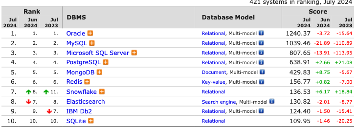

# RDBMS와 NoSQL

## RDB (Relational Database)

- 관계형 데이터베이스는 Key와 Value들의 간단한 관계를 테이블화 시킨 데이터베이스이다.
- 모든 데이터를 2차원 테이블 형태로 표현
- 스키마에 맞춰 데이터를 관리하기 때문에 정합성을 보장할 수 있다.
- 조인을 포함해 복잡한 조건을 포함하는 데이터 검색이 가능하다.
- 정규화를 통해 중복성을 줄이고 데이터 무결성을 개선할 수 있다.

## RDBMS (Relational DataBase Management System)

- RDB를 생성하고 관리할 수 있는 소프트웨어다.
- RDBMS 종류에는 `MySQL`, `PostgreSQL`, `Oracle`, `Microsoft SQL Server`, `MariaDB` 등이 있다.
- 현재 (2024/07) 기준 가장 인기있는 10개의 RDBMS는 다음과 같다.

    

## NoSQL
Not Only SQL 이라는 슬로건에서 생겨난 데이터베이스이다.
웹 서비스가 발전하면서 이미지, 동영상 같은 멀티 미디어뿐 아니라 자유로운 형식의 텍스트같은 비정형 데이터가 대량 생산되는데 \ 
이런 데이터들을 관계형 데이터베이스를 통해 관리하려면 비용이 증가하게 된다.

=> 이러한 비정형 데이터들을 다룰 대안으로 NoSQL이 발전했다.

## 특징
- ACID를 위한 트랜잭션 기능을 제공하지 않는 대신 빠른 속도를 제공한다.
- 데이터 구조를 미지 정의할 필요 없고 수시로 변경 가능하다.
- 관계형 데이터베이스에 비해 확장성 측면에서 효율적이다.

## 선택 기준

### RDBMS
데이터 구조가 명확하고, 변경될 여지가 적으며 스키마가 중요한 경우 사용한다. \
또한 중복된 데이터가 없어 변경이 용이해서 관계를 맺는 데이터의 변경이 잦은 경우 사용하는 것이 유리하다.
### NoSQL
데이터의 구조를 결정하기 어렵고 데이터가 확장/변경될 수 있는 경우 사용한다. \ 
데이터의 중복이 발생할 수 있고, 중복된 데이터가 변경될 시 모든 컬렉션에서 수정해야하기 때문에 \ 
Update가 자주 일어나지 않는 경우에 알맞다. \ 
Scale-out에 유리하기 때문에 대량의 데이터 처리에 사용하기 적합하다.
