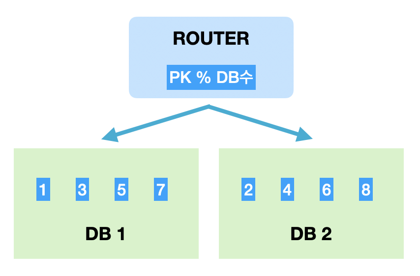
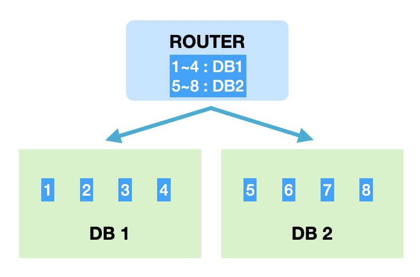

## 데이터베이스 샤딩 (Sharding)

### 샤딩이란
대규모 분산 데이터베이스 시스템에서 데이터를 수평으로 분할하여 여러 서버에 분산 저장하는 기술

데이터베이스의 성능과 확장성을 향상시키는 데 중요한 역할 \
대표작으로 모듈러 샤딩과 레인지 샤딩이 있다.

### 특징
가장 큰 장점은 확장성과 성능 향상입니다. 샤딩을 통해 데이터를 여러 서버에 분산 저장함으로서 \
단일 서버에 집중되는 부하를 줄이고 전체 시스템의 처리량을 증가 시킬 수 있다.

각 샤드는 독립적으로 운영되어 장애의 전파를 막아주고, \
대규모 단일 DB에 비해 샤드는 행 수가 적어 검색 시간에 이점을 얻을 수 있습니다. \
또한, 증설에 용이하기 때문에 효율적으로 크기를 조절할 수 있다

### 공통 요구 사항
모듈러샤딩과 레인지샤딩의 공통된 요구사항
- 라우팅을 위해 구분할 수 있는 유일한 키걊이 존재한다.
- 올바른 DB를 찾을 수 있어야 한다.
- 설정으로 쉽게 증설이 가능해야 한다.

### Modular sharding

    

모듈러 샤딩은 PK 값을 모듈러 연산해서 나온 결과로 DB를 결정하는 방식 \
데이터가 균일하게 분산되지만 추가로 증설하는 과정에서 모든 데이터를 재졍럴해야한다.

모듈러 방식을 데이터의 양이 어느정도 유지될 것으로 예상되는 데이터를 가지는 곳에 적합합니다. \
예를들어 데이터 정책상 유지 기간이 24시간은 컨텐츠의 경우 데이터가 쌓이는 양이 어느정도 한정되어 있기 때문에 모듈러 샤딩을 적용하기에 좋습니다. \
또한, 데이터가 꾸준히 늘어날 수 있어도 적재 속도가 빠르지 않다면 모듈러 방식으로 분산처리 할 수도 있습니다.

### Range sharding

    

레인지샤딩은 PK의 범위를 기준으로 DB를 특정하는 방식 \
증설시에 재정렬 비용이 들지 않지만 일부 데이터에 요청이 몰릴 수 있다.

레인지 샤딩의 가장 큰 장점은 증설 비용이 작다는 점이지만 경우에 따라서 \
활성 유저가 몰린 DB에 요청이 몰리거나 그에 반해 오랜된 데이터엔 요청이 거의 없는 경우가 있을 수 있습니다.

이런 경우엔 부하가 많은 DB는 다시 분할하고 트래픽이 저조한 DB는 통합해서 유지비용을 아낄 수 있습니다.

