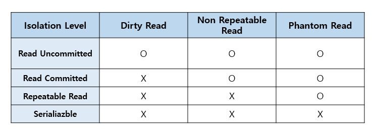

# 트랜잭션 격리수준

트랜잭션에 일관성 없는 데이터를 허용하도록 하는 수준

데이터베이스는 ACID 특징과 같이 트랜잭션이 독립적인 수행을 하도록 한다. \
하지만 락을 너무 엄격하게 설정하면 성능이 떨어지고 \ 
너무 느슨한 락 수준은 잘못된 값이 처리될 수 있다.

=> 상황에 맞는 효율적인 락 전략이 필요하다.

## 관련 현상
## DIRTY READ (더티 리드)
어떠한 트랜잭션에서 작업이 완료되지 않았음에도 다른 트랜잭션에서 볼 수 있는 현상

## NON-REPEATABLE READ (반복 가능하지 않은 조회)

- 동일한 SELECT 쿼리를 실행 했을 때 항상 같은 값을 보장해야 한다는 "REPEATABLE READ" 정합성에 어긋나는 현상 
- 한 트랙잭션 내의 같은 행에 두 번 이상의 조회가 발생했는데, 그 값이 다른 현상이다.

## PHANTOM READ (팬텀 리드)

- 한 트랜잭션 내에서 동일한 쿼리를 보냈을 때 이전 쿼리의 결과에서 존재하지 않던 레코드가 나타나는 현상
- ex) 상품 리스트에 5000원 이상인 제품을 검색했을 때 3개가 조회 되었는데, \
다시 조회하는 사이에 다른 트랜잭션에서 6000원짜리 물품이 추가되고 다시 조회하니 4개가 조회되는 상황

위와 같은 현상을 모두 막으면 좋겠지만 그렇게 되면 제약사항이 많아지기 때문에 \ 
4단계의 격리 수준을 만들어 허용하는 현상을 조절할 수 있다.

## 트랜잭션 격리 수준 (Isolation Level)

### 1. READ UNCOMMITTED
- 다른 트랜잭션에서 커밋되지 않은 내용도 조회할 수 있다.
- 무결성을 위해 사용하지 않는다.

### 2. READ COMMITTED
- 다른 트랜잭션에서 커밋된 내용만 조회할 수 있다.
- 다른 트랜잭션이 접근한 행을 또 다른 트랜잭션이 수정할 수 없다.
- 많은 DB의 디폴트 설정값

### 3. REPEATABLE READ 
- 트랜잭션이 시작하기 이전에 커밋된 내용만 조회할 수 있다.
- 팬텀리드가 발생할 수 있지만 일반적으로 MySQL에선 해당 문제도 해결되어 있다.
- MySQL의 기본 설정값이다.

### 4. SERIALIZABLE
- 트랜잭션을 매우 엄격하게 순차적으로 진행한다
- 트랜잭션이 진입하면 락이 걸리고 다른 트랜잭션이 접근하지 못한다.
- 교착 상태가 발생할 확률이 높고 성능이 매우 떨어진다.

### 요약

    

