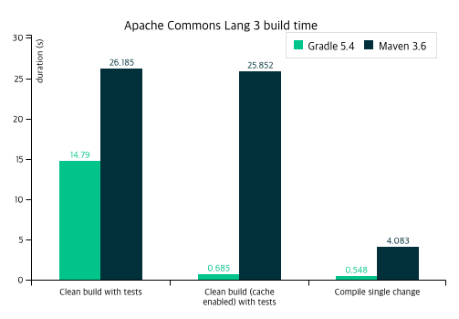

# Gradle (그래들)

<div align='center'>
    
</div>

Gradle은 아래의 작업들을 자동화 시켜주는 Groovy 기반의 오픈소스 빌드 도구
- **Compile** - java 파일의 소스 코드를 컴퓨터가 이해할 수 있도록 바이트 코드로 변환
- **Test** - 유닛 테스트, UI 테스트
- **Packaging** - 스프링 코드를 패키징 해 .jar 파일이나 .war 파일로 생성
- **Deploy & Run** - 서버 실행

>### 빌드 도구란?
> 소프트웨어 개발에 있어서 소스 코드를 실행 가능한 어플리케이션으로 만들어 주는 도구
> 빌드 과정을 자동화 하여 관리하는 기능을 하기 때문에 빌드 관리 도구 또는 빌드 자동화 도구라고 합니다.


## Gradle의 장점

## 1) 간결한 스크립트
Gradle 이전의 빌드 도구인 Ant와 Maven은 XML 문법으로 스크립트를 작성하였습니다. \ 
하지만 XML은 태그 문법 때문에 복잡한 빌드 스크립트를 작성하기에는 까다로우며 가독성또한 떨어집니다. \
반면, Gradle은 Groovy 문법으로 간결한 스크립트를 작성할 수 있습니다.

 - `pom.xml`
```xml
<project ... 생략 ...>
 
    <modelVersion>4.0.0</modelVersion>
    <groupId>그룹 ID</groupId>
    <artifactId>아티팩트 ID</artifactId>
    <version>버전</version>
    <packaging>jar</packaging>
    <name>이름</name>
 
    <properties>
        ...
        속성 정보
        ...
    </properties>
 
    <dependencies>
        ... 
        의존 라이브러리 정보 
        ...
    </dependencies>
 
</project>
```

- `gradle (Groovy)`

```Groovy
plugins {
    id 'java'
    id 'org.springframework.boot' version '3.3.1'
    id 'io.spring.dependency-management' version '1.1.5'
    id 'org.asciidoctor.jvm.convert' version '3.3.2'
}

group = 'com.example'
version = '0.0.1-SNAPSHOT'

java {
    toolchain {
        languageVersion = JavaLanguageVersion.of(17)
    }
}

configurations {
    compileOnly {
        extendsFrom annotationProcessor
    }
}

repositories {
    mavenCentral()
}
 
dependencies {
	...
}

tasks.named('test') {
    outputs.dir snippetsDir
    useJUnitPlatform()
}
```
## 2) 빠른 빌드 속도

### 점진적 빌드
작업의 상태를 추적하고, 변경점만 처리하여 작업한다. \
매번 모든 파일을 빌드하지 않고 변경된 내용만 빌드한다.

### 캐싱
Gradle은 캐싱을 하기 때문에 다른 빌드 툴 보다 빠르다.

위와 같이 Gradle 높은 성능을 내기 위해 여러가지 기능을 제공한다. \
아래는 Gradle 공식문서에 있는 성능 비교표이다. \ 
상황에 따라서 2배에서 최대 100배에 가까운 성능 이점을 가진다.

<div align='center'>
    
</div>

## Gradle 사용
기본적으로 생성했을 때 Gradle 프로젝트 구조이다.
```
├── build.gradle
├── .gradle
├── gradle 
│     └── wrapper 
│           ├── gradle-wrapper.jar 
│           └── gradle-wrapper.properties
├── gradlew 
├── gradlew.bat 
├── settings.gradle
```

### [ gradlew, gradlew.bat ]

gradle-wrapper 실행 명령이다. \
`gradlew`는 macOS, Linux용이고, `gradlew.bat`는 윈도우 실행 명령이다.

### [ settings.gradle ]
프로젝트에 대한 설정 정보를 작성하는 파일

### [ build.gradle ]
프로젝트에 필요한 의존성과 빌드 처리 내용을 작성하는 파일

### 플리그인
프로젝트에서 사용하는 Gradle 플러그인
```groovy
plugins {
    id 'java'
}
```

### 저장소
각종 프로그램이 저장되는 위치 \
`mavenCentral()`, `jcenter()` 2개의 저장소가 있다.
```groovy
repositories {
    mavenCentral()
    // jcenter()
}
```

### 의존성 주입
```groovy
dependencies {
	implementation 'org.springframework.boot:spring-boot-starter-data-jpa'
	implementation 'org.springframework.boot:spring-boot-starter-validation'
	implementation 'org.springframework.boot:spring-boot-starter-web'
	compileOnly 'org.projectlombok:lombok'
	runtimeOnly 'com.h2database:h2'
	runtimeOnly 'com.mysql:mysql-connector-j'
	annotationProcessor 'org.projectlombok:lombok'
	testImplementation 'org.springframework.boot:spring-boot-starter-test'
	testImplementation 'org.springframework.restdocs:spring-restdocs-mockmvc'
	testRuntimeOnly 'org.junit.platform:junit-platform-launcher'
}
```

- `implementation`: 내부 의존성을 런타임에서만 보이는 구현 의존성
- `compileOnly`: compile에만 필요하고, runtime에는 필요 없는 라이브러리
- `runtimeOnly`: runtime에만 필요하고, compile에는 필요없는 라이브러리
- `annotationProcessor`: 어노테이션 기반 라이브러리를 컴파일러가 인식하도록 함 (lombok, queryDSL)
- `testImplementation`: 테스트에 사용하는 라이브러리