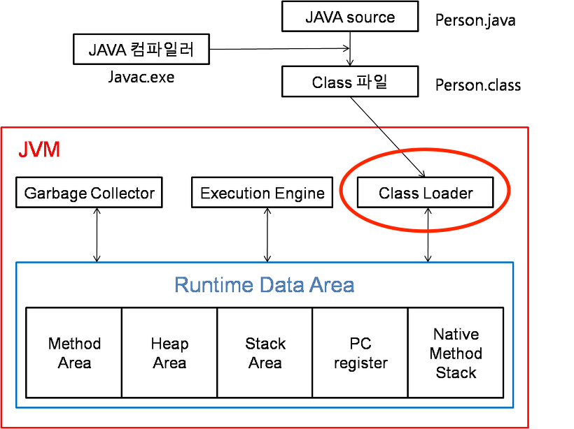

## Reflection
구체적인 클래스 타입을 알지 못해도 그 클래스의 메서드, 타입, 변수들에 접글할 수 있도록 해주는 API

<div align='center'>
    
</div>

JVM은 **클래스 정보를 클래스 로더를 통해 읽어와서 해당 정보를 JVM 메모리에 저장**한다. \
저장된 클래스의 정보가 거울과 같아서 **리플렉션**이라는 이름을 가지게 되었다. \
리플랙션을 사용해서 **생성자, 메서드, 필드등등 클래스에 관한 정보**를 얻을 수 있다.

대표적인 예시로 스프링에서 사용하는 어노테이션이 리플렉션을 활용한 것이다. \ 
리플렉션을 사용하면 클래스와 메서드에 어떤 어노테이션을 사용했는지 알수 있다.

## Class 클래스
`java.lang` 패키지에서 제공되는 실행중인 자바 어플리케이션의 클래스와 인터페이스의 정보를 가진 클래스

### Class 객체 획득 방법
```java
// 방법 1
Class<Member> aClass = Member.class;

// 방법 2
Member member1 = new Member();
Class<? extends Member> bClass = member1.getClass();

// 방법 3
Class<?> cClass = Class.forName("hudi.reflection.Member");
```
### getMethods vs getDeclaredMethods

- `getMethods` : 상위 클래스와 상위 인터페이스에서 **상속한 메서드를 포함하여 public인 메서드들을 모두 가져온다**
- `getDeclaredMethods` : 접근 제어자와 관계 없이 상속한 메서드를 제외하고 **직접 클래스에서 선언한 메서드들을 모두 가져온다**

### 기본 생성자 필요성
선언된 생성자가 많이 있어도 기본 생성자가 반드시 필요한데, \
조금씩 차이날 수도 있는 선언된 생성자가 아닌 기본 생성자를 통해 \ 
객체를 생성한 후에 필드 이름에 매칭해서 알맞은 값을 채우는 방식

### Reflection 장점
1. 런타임에서 클래스를 생성하고, 접근 제어자와 관계없이 필드와 메서드에 접근하여 작업 수행 가능
2. 프로그램의 유연성을 높여준다.

### Reflection 단점
1. 일반 메서드 호출보다 성능이 훨씬 떨어진다.
   - 런타임에 클래스를 분석하기 때문에 JVM 최적화가 불가능해 성능이 떨어진다.
2. 컴파일 시점에서 타입 체크가 불가능하다. -> 필요한 곳에 정확하고 한정적으로 사용

## Reflection 정리

1. **동적인 객체 생성** 
   - Reflection을 사용하면 런타임 시에 동적으로 객체를 생성한다.
   - 유연한 객체 생성 패턴 구현에 도움
2. **클래스 정보 조사**
   - 클래스의 메서드, 필드 등의 정보를 동적으로 조사할 수 있다.
   - 예를들어 특정 어노테이션을 가진 메서드를 찾거나 필드이 값을 변경할 수 있다.
3. **동적 메서드 호출**
   - 매서드의 이름과 매개변수를 동적으로 지정하여 메서드를 호출할 수 있다.
4. **어노테이션 처리**
   - 런타임시에 어노테이션을 분석하여 특정 작업을 수행
   - 어노테이션 기반으로 동적으로 코드 생성 가능
5. **리소스 접근**
   - 클래스 로더를 통해 클래스 경로의 파일이나 설정 파일등을 로드하여 사용


