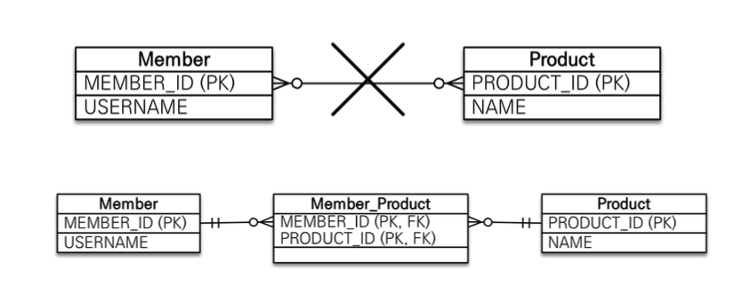
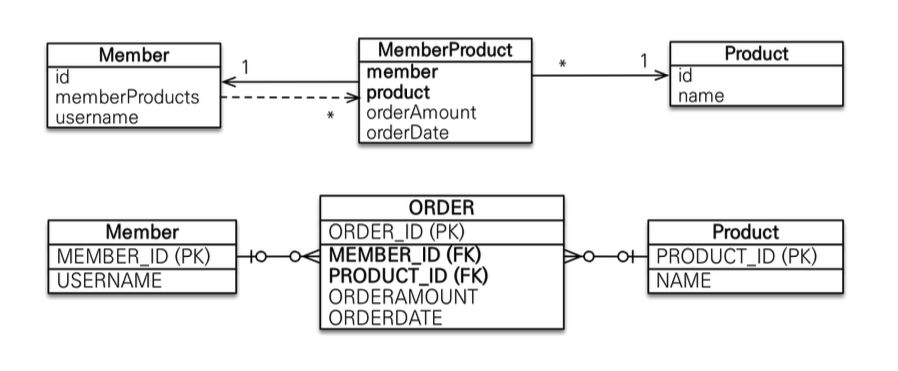

##  M : N 매핑 상황 

관계형 데이터베이스는 정규화된 테이블 2개로 다대다 관계를 표현할 수 없음

연결 테이블을 추가해서 일대다, 다대일 관계로 풀어내야함

<div align='center'>
    
</div>

### Member Class
```java
@Entity
public class Member {

	@Id
    @Column(name = "MEMBER_ID")
    private Long id;

    @ManyToMany
    @JoinTable(name = "member_product,
    		  joinColumns = @JoinColumn(name = "MEMBER_ID"),
              inverseJoinColumn = @JoinColumn(name = "PRODUCT_ID"))
    private List<Product> products = new ArrayList<>();

    @Column(name = "USERNAME")
    private String username;

	// Getter, Setter, Constructor
}
```

### Product Class 
```java
@Entity
public class Product {

    @Id
    @Column(name = "PRODUCT_ID")
    private Long id;

    @ManyToMany(mappedBy = "products")
    private List<Member> members = new ArrayList<>();

    @Column(name = "NAME")
    private String name;

    // Getter, Setter, Constructor
}
```

### 다대다 매핑의 문제점 

- JPA에서는 @ManyToMany를 통해 연관관계를 매핑할 경우 하이버네이트가 중간 테이블을 알아서 만들어서 처리해준다
- 필수적인 정보만 담기기때문에 비즈니스상 필요한 정보는 담을 수 없다

### 해결 방법

직접 중간 테이블을 추가해서 일대다와 다대일의 관게로 풀어내야한다.

<div align='center'>
    
</div>

### Member Class

```java
@Entity
public class Member {

    @Id
    @Column(name = "MEMBER_ID")
    private Long id;

	// 연결 테이블(MEMBER_PRODUCT)쪽이 외래키를 갖고있기 때문에, 연결 테이블이 연관관계의 주인이다.
    @OneToMany(mappedBy = "member")
    private List<MemberProduct> memberProducts = new ArrayList<>();

    @Column(name = "USERNAME")
    private String username;

    // Getter, Setter, Constructor

}
```

### Product Class

```java
@Entity
public class Product {

    @Id
    @Column(name = "PRODUCT_ID")
    private Long id;

    @Column(name = "NAME")
    private String name;

    // Getter, Setter, Constructor
}
```

### Order Class

```java
@Table(name = "ORDERS")
@Entity
public class MemberProduct {

    @Id
    @Column(name = "ORDER_ID")
    private Long id;

    @ManyToOne
    @JoinColumn(name = "MEMBER_ID")
    private Member member;

    @ManyToOne
    @JoinColumn(name = "PRODUCT_ID")
    private Product product;

    @Column(name = "ORDERAMOUNT")
    private Integer orderAmount;

    @Column(name = "ORDERDATE")
    private LocalDateTime orderDate;

    // Getter, Setter, Constructor
}
```


