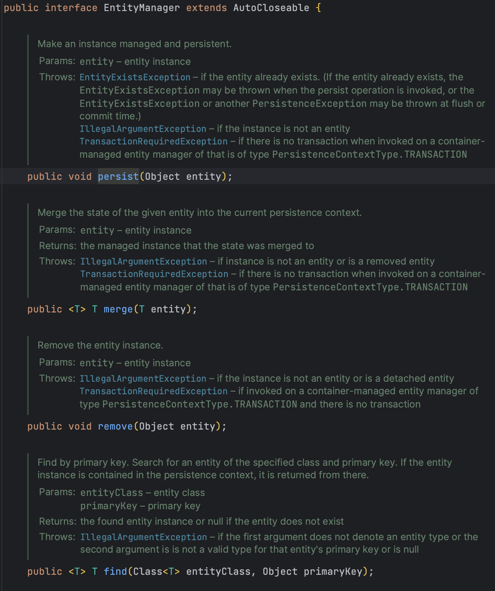
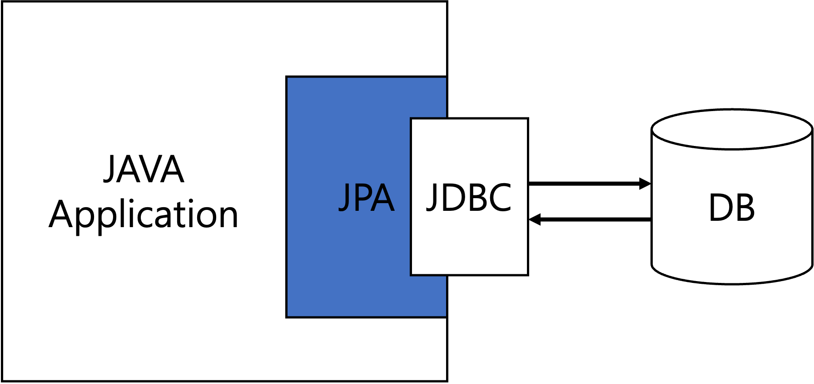
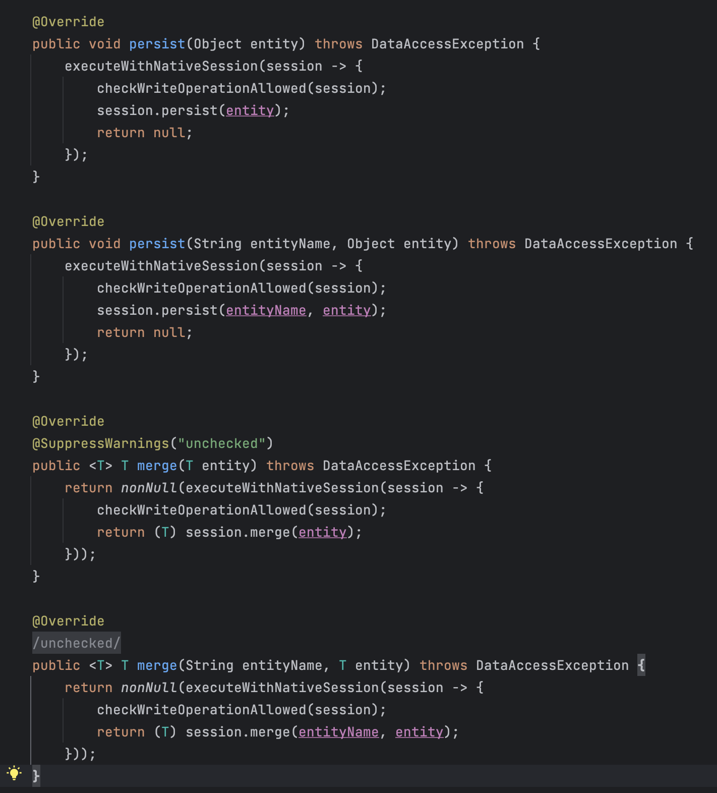

## JPA와 Hibernate

## JPA (Java Persistence API)
자바 진영의 ORM 기술 표준으로 사용되는 인터페이스 모음

    

> ### ORM이란?
> Object-Relational Mapping의 약자로 코드는 코드대로 DB는 DB대로 설계하고
> 중간에 ORM 프레임워크가 중간에서 매핑

    

JPA는 어플리케이션과  JDBC 사이에서 동작하며 \
어플리케이션에 객체를 매핑하기 위한 인터페이스를 제공한다.

### 특징
- SQL 중심이 아닌 객체 중심의 개발
- 패러다임 불일치 해결
- 데이터 접근 추상화를 통한 편리한 벤더 변경
- 간단한 CRUD SQL 반복 처리

### 장점
- SQL이 아닌 메서드로 DB를 조작해 비즈니스 로직에 집중 가능
- 객체지향적인 코드 작성 가능
- DB를 변경해도 코드 수정 필요 없음

### 단점
- 잘못 설계할 경우 예상하지 못한 쿼리 발생
- 복잡한 쿼리의 경우 직접 sql 튜닝 필요

## Hibernate
JPA의 구현체로 JPA의 인터페이스를 구현하며, 내부적으로 JDBC API 사용

    

Hibernate를 사용하면 자연스러운 객체 지향 관용구를 따르는 영구 클래스를 개발할 수 있다. \
개발자 생산성과 런타임 성능 측면에서 JDBC 코드 보다 우수한 성능을 일관되게 제공함.