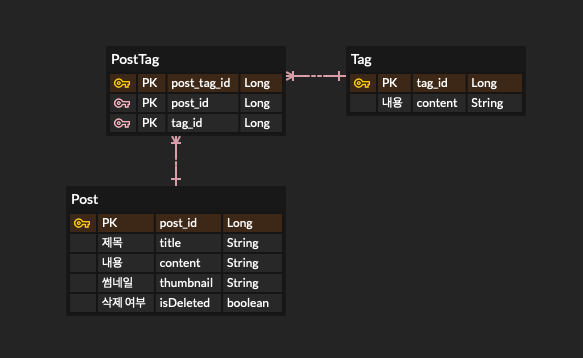

## Paging + fetch join 문제
### 문제 상황

### 연관관계

<div align='center'>
    
</div>

게시글은 여러개의 태그를 가질 수 있고, 특정 태그를 포함하는 게시글을 검색할 수 있어야 한다.
→ 다대다 관계를 매핑 테이블(PostTag)을 두어 연관관계 구성

### 페치 조인과 페이징 처리

전체 게시글 조회의 경우 게시글의 정보와 태그 정보, 작성자 정보가 필요한데 이 모든 정보를 join 없이 처리하면 수많은 쿼리가 발생할 수 있다. 따라서 JPA에서 제공하는 fetch join을 통해 이 문제를 해결할 수 있다고 생각했다.

하지만 JPA는 fetch join과 페이징 처리를 한번에 사용할 경우 페치 조인만 쿼리를 통해 해결하고 페이징 처리는 서버 메모리에서 하기 때문에 OOM(Out of Memory) 에러가 발생할 수 있다.

이런 문제들을 해결하기 위해 여러가지 옵션을 선택해 보며 최선의 방법을 찾았습니다.

## 해결 과정

### 1. fetch join 페이징

- 소요시간 : 약 6초
- 총 쿼리 : 18개 → 1 (카운트 쿼리) + 1 (본 쿼리) + 16 (Tag N+1)

쿼리가 비교적 적게 나가지만 메모리에서 직접 페이징을 처리하기 때문에 매우 오래 걸리고 ,
OOM 에러가 발생한 위험도 높다.

### 2. fetch join X 페이징

- 소요시간 : 약 0.3초
- 총 쿼리 : 53개 -> 1 (카운트 쿼리) + 1 (본 쿼리) + 20 (PostTag N+1 ) + 31(Tag N+1)

속도는 많이 빨라지지만 N+1문제가 여기저기서 발생한다. 지금은 더미 데이터라 단순한 데이터로 구성되어 있어 쿼리가 비교적 적게 나가지만 실제 사용하는 데이터가 적재되기 시작하면 수많은 N+1 문제가 발생할 수 있다.

### 3. fetch join X 페이징 + BatchSize → 좀 더 쿼리 파악 필요 (생각보다 많이 나감)

- 소요시간 : 약 0.3초
- 총 쿼리 : 37개 → 1 (카운트 쿼리) + 1 (본 쿼리) + 20 (PostTag N+1 ) + 15(Tag N+1)

BatchSize로 인해서 조금 쿼리가 줄어들었지만 여전히 PostTag의 경우 페이지의 크기 만큼 추가적인 쿼리가 나가고 Tag 쿼리의 경우도 조금 줄긴했지만 여전히 중복적인 부분이 없다면 문제가 있을 수 있다.

### 4.Sub Query Paging + fetch join

- 소요시간 : 약 0.1 초
- 총 쿼리 : 3개
    - 1개 (카운트 쿼리) + 1개 (본 쿼리) + 1개 (서브 쿼리)

```java
// step 1: 조건에 맞는 게시글의 ids 리스트를 페이징 적용해서 조회
List<Long> postIds = queryFactory
		.select(post.id)
		.from(post)
		.where(post.isDeleted.eq(false))
		.orderBy(post.id.desc())
		.offset(pageable.getOffset())
		.limit(pageable.getPageSize())
		.fetch();

if (postIds.isEmpty()) {
		return new RestPage<>(new PageImpl<>(Collections.emptyList(), pageable, 0));
}

// step 2: 해당 Post ID들을 이용해 연관된 엔티티를 페치 조인으로 조회
//         in 절 안에 있는 ids에 이미 페이징이 적용되어 있기 때문에 전체 결과도 페이징과 같은 효과 있음
List<Post> posts = queryFactory
		.selectFrom(post)
		.leftJoin(post.writer, QUser.user).fetchJoin()
		.leftJoin(post.postTags, QPostTag.postTag).fetchJoin()
		.leftJoin(QPostTag.postTag.tag, QTag.tag).fetchJoin()
		.where(post.id.in(postIds))
		.orderBy(post.id.desc())
		.fetch();

// 전체 Post 카운트 쿼리
long count = queryFactory
		.select(post.id)
		.from(post)
		.where(post.isDeleted.eq(false))
		.fetch().size();

List<PostSimpleResponse> result = posts.stream()
		.map(this::toSimpleResponse)
		.toList();

return new PageImpl<>(result, pageable, count);
```

- 페이징이 적용된 postIds를 조회한다. → 클러스터링 인덱스이기 때문에 커버링 인덱스 활용을 통한 빠른 조회
- 만약 결과가 없다면 빈 리스트를 결과로 반환
- 이미 걸러진 postId 리스트를 where 문의 in 절에 넣어 페치조인이 가능하도록 querydsl 활용
- 실제로 데이터가 페이징이 되는 것은 아니기 때문에 조건에 맞는 정렬 조건을 추가
- PageImpl을 통해 Page 객체로 반환

## 결과

페이징이 적용된 서브 쿼리와 페치 조인의 적절한 조합으로 원하는 정보를 최소한의 쿼리로 조회하고,

페이징 처리를 추가로 페이지 객체로 적절히 처리했습니다. 

1 + 1 + N + N ⇒ 1 + 1 + 1 로 최적화

소요 시간 6초 → 0.1초로 최적화 (더미 데이터 10만개의 게시글 + 50가지 종류의 태그)

