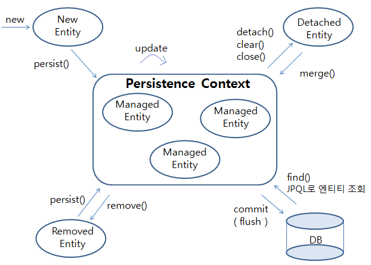
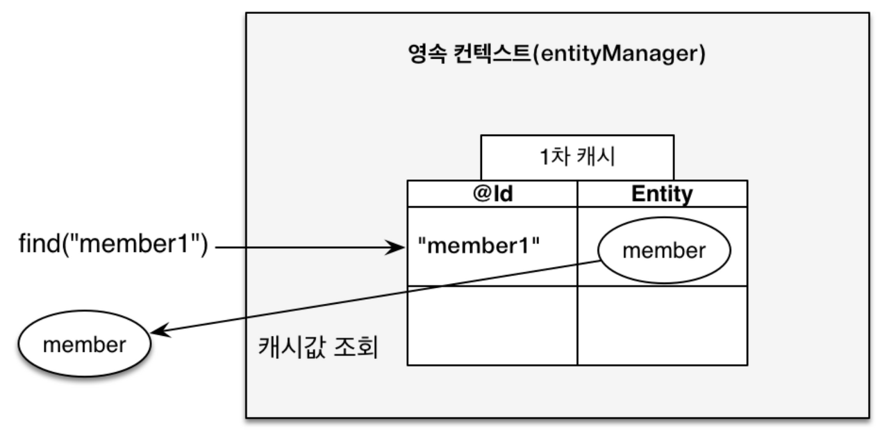
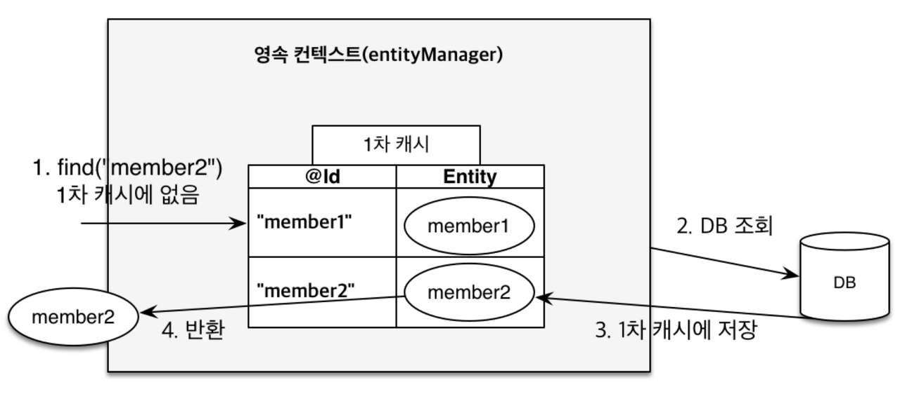
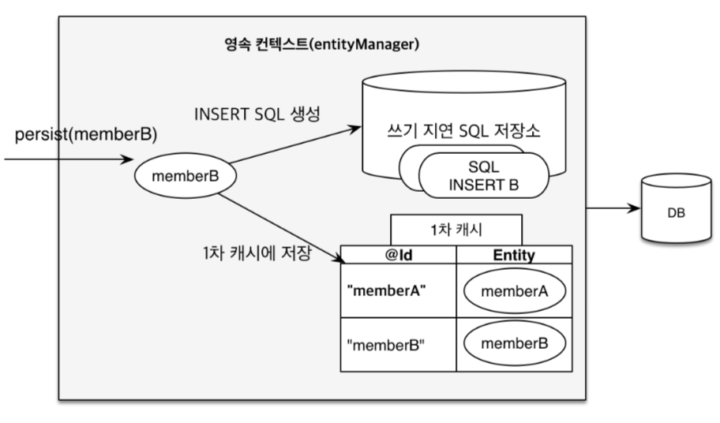
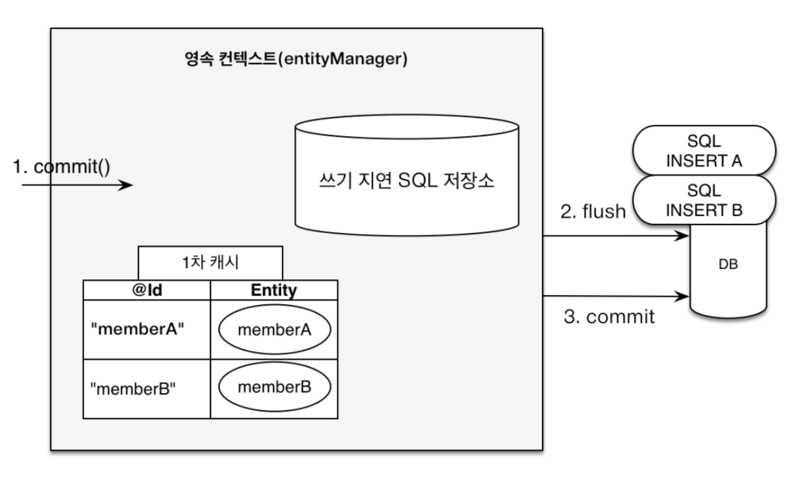

## 영속성 컨텍스트
### 영속성이란?
- Persistence
- 사전적 의미 : 영구적인 성질. 또는 그러한 능력
- 프로그래밍에서의 의미 : 어플리케이션의 상태와 관계없이 데이터를 물리적으로 저장하는 행위

### 영속성 컨텍스트 (Persistence Context)

- 엔티티를 영구적으로 저장하는 환경
- `EntityManager` 의 메서드를 활용
- `${EntityManager}.persist(${Entity});` 를 실행 하면 엔티티 객체가 영속성 컨텍스트에 의해 관리
- `EntityManger` 가 커밋 시점에 영속성 컨텍스트에 의해 관리되던 객체들의 변경사항을 감지, 추적해 저장소에 반영하는 요청을 보낸다

### 엔티티의 생명 주기

<div align='center'>
    
</div>

- **New**
  - 비영속 상태
  - 엔티티가 생성 됐지만, 저장은 되지 않은 상태
- **Managed**
  - 영속 상태
  - 영속성 컨텍스트에 저장된 상태
  - DB에는 저장 되지 않은 상태
- **Detached**
  - 준영소 상태
  - 영속성 컨텍스트에서 관리 되다가 분리된 상태
- **Removed**
  - 삭제된 상태
  - 영속성 컨텍스와 DB에서 제거된 상태

## 영속성 컨텍스트의 특징

### 식별자
- 영속성 컨텍스트는 `식별자값(PK)` 으로 엔티티를 구분한다.
- 모든 영속상태의 객체는 식별자를 가지고 있고 없다면 에러가 발생

### COMMIT & FLUSH
- `COMMIT` : 엔티티를 저장하고 트랜잭션을 커밋해야 실제 DB에 반영된다.
- `FLUSH` : 현재 영속성 컨텍스트의 변경 내용을 DB에 반영하는 작업

### 1차 캐시

<div align='center'>
    
</div>

<div align='center'>
    
</div>

- 영속성 컨텍스트 내부에는 엔티티를 저장하는 1차 캐시가 존재하낟.
- 트랜잭션 내에서 유효한 생명주기를 갖는다.
- 같은 트랜잭션 내에선 1차 캐시에 존재하는 엔티티에 접근할 땐 DB에 접근하지 않아도 된다.
- 커밋과 함께 초기화 된다.

```java
  tx.begin();                          

  em.persist(new MyEntity(1, "entity1"));

  tx.commit();                            
```

### 동일성 보장
- 1차 캐시는 Map 구조를 활용한다.
- PK 값을 통해서 엔티티는 == 연산을 통해 동일성을 보장한다.

```java
  MyEntity newEntity = new MyEntity(1, "entity1");

  em.persist(newEntity);                             
  MyEntity foundEntity = em.find(MyEntity.class, 1);

  System.out.println(foundEntity == newEntity);
```
### 쓰기 지연

<div align='center'>
    
</div>

<div align='center'>
    
</div>

트랜잭션 내의 발생한 쿼리를 발생 시점에 요청하는 것이 아니라 commit, flush 시점에 한번에 요청

```java
  tx.begin(); // 트랜잭션 시작
  System.out.println("transaction began\n");

  MyEntity newEntity = new MyEntity(1, "entity1");
  em.persist(newEntity);                            
  MyEntity foundEntity = em.find(MyEntity.class, 1);
  System.out.println(foundEntity);

  tx.commit(); // 트랜잭션 종료, 데이터베이스 반영
  System.out.println("\ntransaction committed");
  ...

  Result ======================================================

  ...
  transaction began

  MyEntity(id=1, value=entity1)
  Hibernate: 
      /* insert example.entity.MyEntity
          */ insert 
      into
          MyEntity (value, id) 
      values
          (?, ?)

  transaction committed
```

### 변경 감지
<div align='center'>
    
</div>

- 엔티티를 영속성 컨텍스트에 보관할때, 최초 상태에 대한 스냅샷을 저장해둔다.
- 커밋 시점에 각각의 엔티티 상태와 스냅샷을 비교해 변경된 사항이 있다면 SQL 버퍼에 Update 쿼리를 추가한다.

```java
  tx.begin();
  System.out.println("transaction began\n");

  foundEntity = em.find(MyEntity.class, 1);
  foundEntity.setValue("changed value");

  tx.commit();
  System.out.println("\ntransaction committed");
  ...

  Result ======================================================

  ...
  transaction began

  Hibernate: 
      select
          m1_0.id,
          m1_0.value 
      from
          MyEntity m1_0 
      where
          m1_0.id=?
  Hibernate: 
      /* update
          example.entity.MyEntity */ update MyEntity 
      set
          value=? 
      where
          id=?

  transaction committed
```


