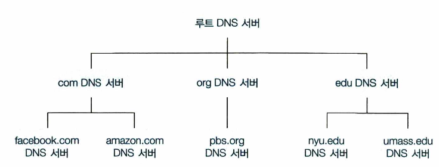
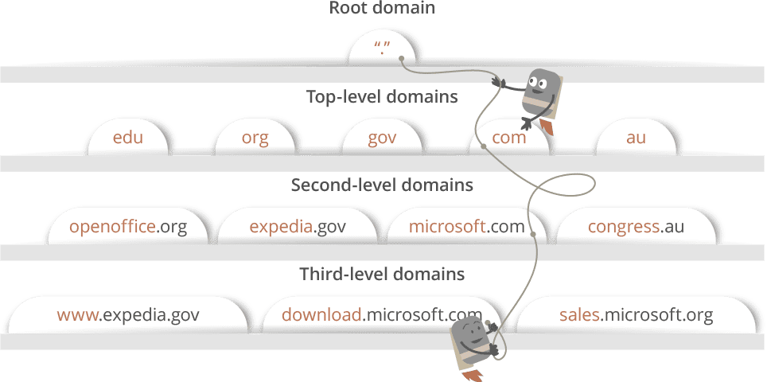

## TCP/IP 4계층 모델
### 1. 어플리케이션 계층
FTP, HTTP, SSH, SMTP, DNS 등 응용 프로그램이 사용되는 프로토콜 계층

### DNS
모든 사이트는 IP 주소를 가지고 있지만 숫자로 이루어진 IP 주소는 사람이 식별하기에 좋지 않다. \ 
하지만 `www.naver.com` 같이 문자로 나타내면 기억하기 좋고 식별하기에도 용이하다.

### DNS(Domain Name System Servers)
사람과 라우터는 서로 선호하는 식별자가 다르다. 이를 연결해주기 위해 호스트 이름을 IP주소로 바꿀 필요가 있다. \
=> **이떄 DNS가 사용된다.**

DNS는 도메인 이름과 IP 주소를 저장하고 있는 분산 데이터 베이스로, **전화번호부**와 비슷하다.

### 1) 분산 계층 데이터베이스 
DNS를 한 곳에 모든 정보를 저장해두면 간단하지만, 중앙 집중 데이터베이스의 고장이나 물리적 거리, \ 
유지관리등의 측면에서 확정성이 부족하다. 

=> 이를 개션하기 위해 **DNS는 여러 서버를 두고 계층 형태로 분산**시킨다.

<div align='center'>
    
</div>

세가지 DNS 서버로 나뉜다.
- 루트 DNS 서버
  - 수많은 루트 서비 인스턴스가 전세계에 흩어져 있다.
  - 루트 네임 서버는 TLD 서버의 주소들을 제공한다.
- 최상위 레벨 도메인 DNS 서버 (TLD, Top-Level Domain)
  - com, org, net...등등 상위 레벨 도메인과 kr, uk,fr등의 국자 상위 레벨 도메인이 있다.
  - TLD 서버는 책임 DNS 서버에 대한 IP주소를 제공
- 책임 (authoritative) DNS 서버
  - 조직의 자체 DNS 서버, 조직의 명명 된 호스트에 대한 IP 매핑에 권한있는 호스트 이름을 제공한다.

### 2) DNS query
ISP의 DNS 서버가 호스팅하고 있는 서버의 IP주를 찾기 위해 DNS query를 날린다.

- **DNS query의 목적**
    - DNS 서버들을 검색해서 해당 사이트의 IP주소를 찾는데에 있다. IP주소를 찾을 때 까지 DNS서버에서 다른 DNS서버를 오가며 에러가 날때까지 반복적으로 검색한다.
    - `재귀적 질의`(recursive search), `반복적 질의`(iterative query)

<div align='center'>
    
</div>

```
'www.google.com' 주소에 대해 검색할 때,
1. DNS recursor가 루트 DNS 서버에 요청
2. .com 도메인 TLD 서버로 리다이렉트
3. google.com 책임 DNS 서버로 리다이렉트
4. 최종적으로 DNS기록에서 'www.google.com' 에 매칭되는 IP주소 찾기
5. 찾은 주소를 DNS recursor로 보내기
```

요청한 호스트에게 매핑 결과를 전달하기 위해 많은 질의 메세지가 필요하다.

그래서 질의 전송을 줄이기 위해서 **DNS 캐싱** 방법을 사용한다.


### 3) DNS 캐싱

DNS 지역 성능 향상과 네트워크의 DNS 메세지 수를 줄이기 위해서 캐싱을 사용한다.

- DNS 서버가 DNS 응답을 받았을 때 그것을 로컬 메모리에 응답 정보를 저장할 수 있다.
- 호스트 이름과 IP 주소 쌍이 DNS 서버에 저장되면 처음 브라우저가 캐싱된 DNS를 확인하고 캐싱된 기록이 없을 때 DNS 질의로 넘어간다.
- 호스트 이름과 IP 주소 사이 매핑과 호스트는 영구적이지 않기 때문에 특정 기간마다 저장된 정보를 제거한다.
