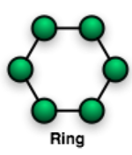
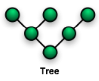
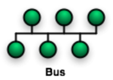
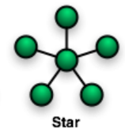
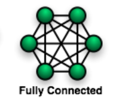

# 네트워크 기초

### 네트워크란?

컴퓨터 등의 장치들이 통신 기술을 이용하여 구축하는 연결망을 지칭

노드(node)와 링크(link)가 서로 연결되어 있으며 리소스를 공유하는 집합

## 처리량과 지연시간

### 좋은 네트워크란?

많은 처리량을 처리할 수 있으며 지연 시간이 짧고 장애 빈도가 적으며 좋은 보안을 갖춘 네트워크

### 처리량
링크를 통해 전달되는 단위 시간당 데이터 양

단위로는 bps(bits per second)를 사용. 초당 전송 또는 수신되는 비트 수

처리량은 사용자들이 많이 접속 할 때마다 커지는 트래픽, 네트워크 장치 간의 대역폭, 네이트워크 중간에 발생하는 에러, 장치의 하드웨어 스펙에 영향을 받습니다.

    

### 지연 시간

지연 시간(latency)이란 요청이 처리되는 시간을 말하며 어떤 메시지가 두 장치를 왕복하는데 걸린 시간

매체 타입, 패킷 크기, 라우터의 패킷 처리 시간에 영향을 받음

## 네트워크 토플로지와 병목 현상

### 네트워크 토폴로지

네트워크 토폴로지는 노드와 링크가 어떻게 배치되어 있는지에 대한 방식이자 연결 형태를 의미

### 링형 토폴로지

    

링형은 각각의 노드가 양 옆의 두 노드와 연결하여, 전체적으로 고리처럼 하나의 연속된 길을 통해 통신을 하는 형태

노드 수가 증가되어도 네트워크상의 손실이 거의 없고 충돌이 발생되는 가능성이 적고 노드의 고장을 쉽게 탐색할 수 있음

네트워크 구성 변경이 어렵고 회선에 장애가 발생하면 전체 네트워크에 영향을 미침

### 트리 토폴로지

    

계층형 토폴로지라고 하며 트리 형태로 배치한 네트워크 구성

노드의 추가, 삭제가 쉬우며 특정 노드에 트래픽이 집중될 때 하위 노드에 영향을 끼칠 수 있음

### 버스 토폴로지

    

중앙 통신 회선 하나에 여러 개의 노드가 연결되어 공유하는 네트워크 구성, 근거리 통신망(LAN)에서 사용

설치 비용이 적고 신뢰성이 우수하며 중앙 통신 회선에 노드 추가, 삭제가 쉬움. 그러나 스푸핑이 가능함

> ### 스푸핑이란
> 스푸핑은 "스위칭 기능"(LAN 상에서 송신부의 패킷을 송신과 관련 없는 다른 호스트에 가지 않도록 하는 기능)을 마비시키거나, 속여서 특정 노드에 해당 패킷이 전송되도록 처리하는 네트워크 공격 기법이다.

### 스타 토폴로지

    

중앙에 있는 노드에 모두 연결된 네트워크 구성

노드 추가 및 에러를 탐지하기 쉽고 패킷의 충돌 발생 가능성이 적음 \
중앙 노드가 아닐 경우 장애 발생시 다른 노드에 영향을 적게 끼침 \
중앙 노드에 장애 발생시 네트워크 전체가 마비되며 설치 비용이 고가

### 메시 토폴로지

    

망형 토폴로지라고도 하며 그물망처럼 연결되어 있는 구조

하나의 노드에서 장애가 발생해도 여러 경로가 존재하므로 트래픽 분산 처리도 가능

노드 추가가 어렵고 유지 보수가 힘들다