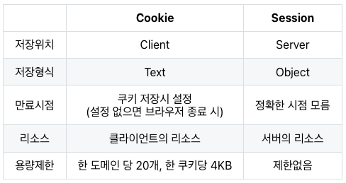

# Cookie

HTTP의 가장 큰 특징은 **무상태성**과 **비연결성**인데, 이런 경우엔 로그인을 하고 새로고침을 하면 로그인 정보가 저장되지 않는다. \
이것을 해결하기 위해선 항상 연결을 유지하고 있어야 하는데, 자원 낭비 문제가 있습니다.

=> HTTP의 비연결성과 무상태성을 보완하여 **서버가 클라이언틀르 식별하게 해주는 것**이 **쿠키와 세션**입니다.

## Cookie 란?
클라이언트 (브라우저) 로컬에 저장되는 **Key와 Value가 들어 있는 작은 데이터** 파일

유효시간을 설정할 수 있고, 브라우저가 종료되어도 인증이 유지된다. \
이후 해당 클라이언트는 요청을 보낼 때 마다 요청 헤더에 Cookie를 담아서 보냅니다.

## 단점
- 보안에 취약하다.
  - 쿠키의 값이 브라우저에서 확인할 수 있어서, 유출이나 조작이 가능하다.
- 용량의 제한이 있어 많은 정보를 담을 수 없다.
- 쿠키의 사이즈가 커질수록 부하가 심해진다.

# Session

쿠키의 가장 큰 단점은 사용자의 정보가 그대로 노출된다는 점이다. \
이런 점을 해결하기 위해 세션이 등장한다.

## Session 이란?
쿠키와 연계하여 **사용자의 정보를 클라이언트 측이 아닌 서버 측에서 관리**하는 방식 \
서버에서 sessionId를 통해 사용자의 정보를 저장하고 해당 id 값을 쿠키에 담아 전달 \

## 차이점
클라이언트는 사용자의 정보를 식별 불가능한 sessionId 를 통해서만 가지고 있고, \
추측 불가능 하기 때문에 변조가 불가능하다. 

## 세션 사용하기
- 세션의 속성 설정
```java
session.setAttribute("id", "value");
```
- 세션의 속성 사용
```java
String id = (String) session.getAttribute("id");
```

- 세션의 속성 삭제
```java
session.removeAttribute("id");
```

- 세션의 속성 전체 삭제
```java
session.invalidate();
```

## 쿠키와 세션 차이점
### 정보가 저장되는 위치
쿠키는 클라이언트에 저장되며 세션은 서버의 자원을 사용한다. \ 
쿠키를 text 형식으로 저장되고 세션은 Object 형식으로 저장된다.
### 보안
쿠키는 누구나 탈취가능하고 변조가 가능하지만 세션을 서버에 저장되어 있기 때문에 접근하기 어렵다. \
만약 의심되는 상황이라면 바로 만료할 수도 있다.
### 요청 속도
세션은 정보가 서버에 있기 때문에 서버 처리가 필요해 요청 속도가 비교적 느린편이다.

## 주의점
세션은 서버의 자원을 사용하기 때문에 사용자 수가 많이지고 정보량이 많이질수록 서버의 메모리를 많이 차지하게 된다. \
너무 많아지면 서버의 응답 속도가 저하될 수 있기 때문에 쿠키와 세션에 적절한 요소를 배치하는 것이 중요하다.

<div align='center'>
    
</div>