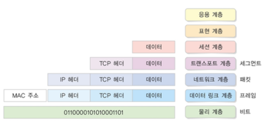
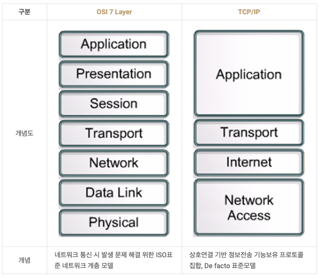

## OSI 7계층 모델

    

국제표준화기구 ISO 에서 개발한 모델. \
네트워크 통신을 계층화해 계층 별 독립적인 역할 분담과 문제발생시 원인 파악 용이 \

## 각 계층별 특징과 프로토콜

### 1계층 - 물리 계층 Physical Layer
- 물리적 통신 매체와 해당 매체를 통해 데이터를 전송하는 기술
- 광섬유 케이블, 구리 케이블 및 공기와 같은 다양한 물리적 채널을 통해 디지털 및 전자 신호를 전송
- PDU : **bit**

### 2계층 - 데이터 링크 계층 Data Link Layer
- 물리 계층이 이미 존재하는 네트워크를 통해 두 시스템을 연결
- 데이터 패킷에 캡슐화된 디지털 신호인 데이터 프레임을 관리
- PDU : **Frame**

### 3계층 - 네트워크 계층 Network Layer
- 분산된 네트워크 하나 또는 연결된 여러 네트워크의 노드 또는 머신을 통한 라우팅, 전달 및 주소 지정
- PDU : **Packet**
- 프로토콜 : IP, ICMP 등

### 4계층 - 전송 계층 Transport Layer
- 데이터 패킷이 손실이나 오류 없이 올바른 순서로 전달
- PDU : Segment
- 프로토콜 : TCP, UDP 등

### 5계층 - 세션 계층 Session Layer
- 한 세션에서 서로 다른 두 애플리케이션 간의 네트워크 조정
- 프로토콜 : SSH TLS 등

### 6계층 -  표현 계층 Presentation Layer
- 수신한 데이터를 변환, 검색, 암호화, 압축 등의 과정을 거져 올바른 방식으로 변환
- 프로토콜 : png, jpg 등

### 7계층 - 응용 계층 - Application Layer
- 응용 프로그램의 정보를 활용하고 통신을 제어
- 사용자와 직접 상호작용하는 계층
- 프로토콜 : HTTP, SMTP, FTP 등

## TCP/IP 4계층과 비교

    

### 공통점
- 계층별 역할 -> 캡슐화, 프로토콜 사용
- 통신 역할 -> 다중화, 페이로드 전송

### 차이점
- OSI 모델은 역할을 기반으로 구성되어 있고, TCP/IP 모델은 프로토콜의 집합을 기반으로 구성
- 통신 전반에 대한 표준화로 OSI가 있고 TCP/IP는 표준 모델은 아니라서 정의하는 방식이 저마다 차이가 있다.