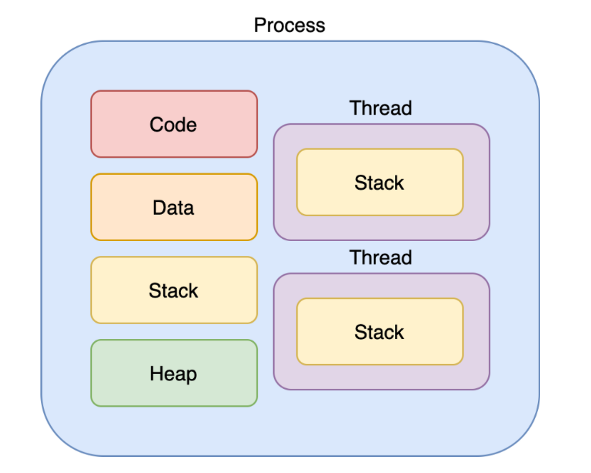

## 프로세스 (Process)

    

운영체제로부터 CPU 자원을 할당 받은 **작업의 단위** 

### 정적 프로그램
윈도우의 `.exe` 파일이나 Mac의 `.dmg` 파일과 같이 컴퓨터에서 실행할 수 있는 파일 \ 
아직 파일을 실행하지 않은 **코드 덩어리** 상태이기 때문에 **정적 프로그램, 줄여서 프로그램**이라고 한다.

### 프로세스
프로세스는 프로그램을 실행시켜 정적은 프로그램이 동적으로 변하여 **작동하고 있는 상태**

모든 프로그램은 운영체제가 실행되기 위한 메모리 공간을 할당해 줘야 실행될 수 있다. \ 
프로그램을 실행하는 순간 파일은 컴퓨터 메모리에 올라가게 되고, 운영체제로부터 자원을 할당 받아 프로그램 코드가 실행된다.

## 쓰레드

    

어떤 프로세스 내에서 실행되는 흐름의 단위

하나의 프로그램은 하나 이상의 프로세스를 가지고 있고, 하나의 프로세스는 반드시 하나 이상의 쓰레드를 갖는다.

### 프로세스의 한계

과거에는 프로그램을 실행할 때 하나의 프로세스만 사용했다. \
하지만 기술이 발전하고 프로그램이 복잡해짐에 따라 하나의 프로세서로 프로그램을 실행하는데 한계가 있었다.

멀티 작업이 힘들다는 문제점을 극복하기 위해 쓰레드가 등장했다.

### 쓰레드의 개념
쓰레드란 하나의 프로세스 내에서 동시에 진행되는 **작업의 갈래, 흐름의 단위**를 말한다. \
하나의 쓰레드가 하나의 동작을 진행하는데, 이런 일련의 작업이 여러개 있다면 **멀티 쓰레드**라고 부른다.

### 특징
- 쓰레드는 프로세스 내에서 각각 Stack만 따로 할당 받고, Code, Data, Heap 영역을 공유한다.
- 같은 프로세스 안에 있는 여로 쓰레드는 같은 힙 공간을 공유한다.
- 다른 프로세스의 메모리에는 접근할 수 없다.

## 멀티 프로세스
멀티 프로세스란 하나의 어플리케이션을 여러 개의 프로세스로 구서하여 각 프로세스가 하나의 작업을 처리하도록 하는 것

### 특징
- 안정성이 좋다
  - 여러개의 프로세스중 하나에 문제가 발생해도, 다른 프로세스에 영향을 주지 않는다.
- 각 프로세스들이 독립적으로 동작하여 서로 다르게 할당된다.
- 프로세스간 통신을 하기 위해서는 IPC를 통해야 한다.
- 메모리 사용량이 많다.
- 스케줄링에 따른 Context Switch이 많아지고, 성능 저하의 우려가 있다.

## 멀티 쓰레드

멀티 쓰레드란 하나의 프로그램을 여러 개의 쓰레드로 구성하여 하나의 쓰레드가 하나의 작업을 처리하도록 하는 것이다.

### 특징
- 응답성이 좋다
  - 하나의 쓰레드가 중지되어도 프로그램이 안정적으로 수행된다.
- 자원 공유가 쉽다.
- 각각의 쓰레드가 병렬적으로 수행될 수 있다.
- 구현 및 테스드, 디버깅이 어렵다.
- 너무 많은 쓰레드 사용은 오버헤드를 발생시킨다.
- 동기화와 교착상태에 주의해야 한다.
- 자식 쓰레드 중 하나에 문제가 생긴경우 전체 프로세스에 영향을 줄 수 있다.
