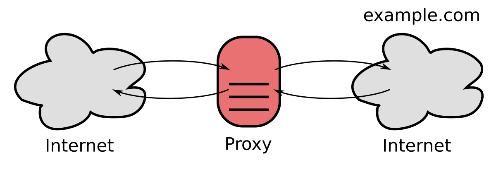
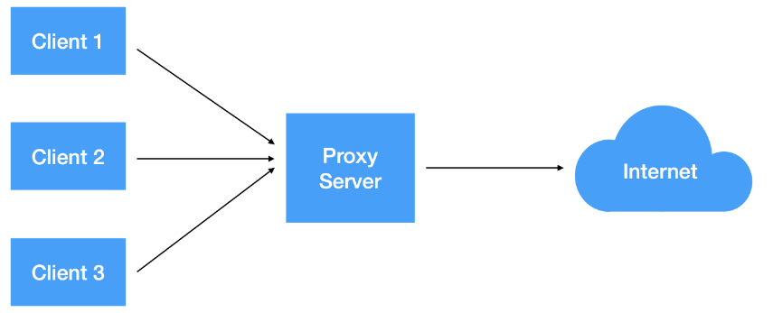
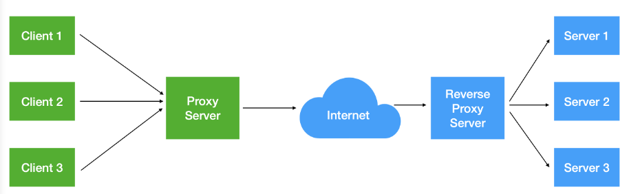
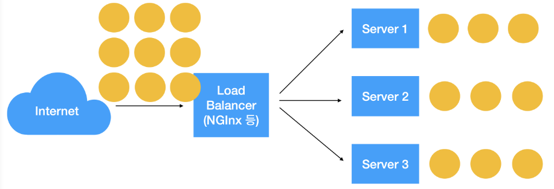

# 프록시 서버
클라이언트가 자신을 통해서 다른 네트워크에 간접적으로 접속할 수 있게 해주는 컴퓨터 시스템이나 응용프로그램을

서버와 클라이언트 사이의 `중계기`로서 대리로 통신을 수행하는 서버를 프록시 서버라고 한다.

    

## 프록시의 특징
1. 클라이언트와 외부 인터넷 사이를 중계
2. 외부에서 내부 침입을 막는 방화벽 기능
3. 캐시의 기능 수행 가능

# 프록시 종류

## Forward 프록시

포워드 프록시는 클라이언트 앞에 위치한다. 내부망에서 클라이언트와 프록시 서버가 통신하여 인터넷을 통해 외부에서 데이터를 가져온다. \
=> 서버에게 클라이언트가 누구인지 감출 수 있다.

    

### 클라이언트 보안
정부, 기업등 내부 사람들의 인터넷 사용에 제한을 설정하기에 좋다. \
예를들어 프록시 서버에 룰을 추가해 특정 사이트 접속을 제한할 수 있다.

### 캐싱
여러 클라이언트가 동일한 자원을 요청하는 경우 매번 새로운 요청을 주고 받지 않고. \
프록시 내에 캐싱해둔 자원을 불러와 부하를 줄이고 속도를 향상시킬 수 있다.

### IP 우회 및 보안 
클라이언트에서 요청을 보낼 때 프록시 서버를 거치게 되면 서버측은 클라이언트 정보가 아닌 \ 
프록시 서버의 정보를 통해 통신하므로 클라이언트의 정보를 숨길 수 있다.

## Reverse 프록시

리버스 프록시는 웹서버/WAS 앞에 위치한다. 내부망에서 프록시 서버와 내부망 서버가 통신하여 인터넷을 통해 들어온 요청을 처리해서 응답한다.
=> 본 서버의 IP 정보를 숨길 수 있다.

    

### 로드 밸런싱

요청에 대한 응답을 처리할 때 서버의 일을 분산시켜 부하가 몰리지 않게 하는 작업

    

### 서버 보안
본 서버의 IP 주소를 직접 노출하지 않을 수 있기 때문에 DDos 공격 같은 공격을 막는데 유용하다.

### 캐싱
포워드 프록시와 마찬가지로 캐싱 기능이 지원된다. 동작 방식은 비슷하다.

### 암호화
SSL 암호화에 유용하다. 본 내부 서버가 클라이언트와 통신시 SSL, TLS로 암호화, 복호화 할 경우 비용이 많이 든다. \
그러나 리버스 프록시를 사용하면 들어오는 모든 요청은 복호화하고, 나가는 응답은 암호화 하면 \ 
안전하게 통신할 수 있고, 본 서버의 부담을 줄일 수 있다.
