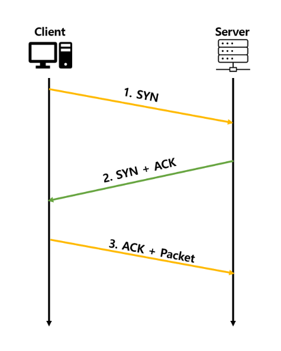
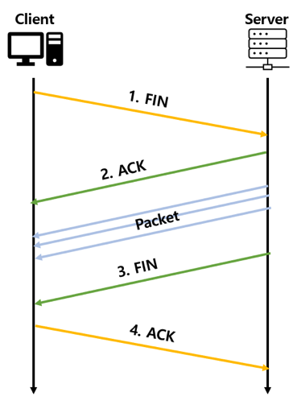

# TCP/IP, UDP

## TCP 통신이란
- 네트워크 통신에서 사용하는 신뢰할 수 있는 프로토콜
- 순서를 보장하고 데이터 전달을 보증한다
- 3way handshake로 양방향 통신을 통해 연결한다

## segment
- SYN : Connection을 생성할 때 사용
- ACK : Data를 전송하면 수신자가 받았음을 알려주기 위해 사용
- FIN : Connection을 끊을 대 사용

## 3way handshake (TCP 연결)

TCP는 정확한 전송을 보장해야 한다 따라서 통신하기에 앞서 논리적인 접속을 성립하기 위해 3way handshake 과정을 진행한다.

    

1. 클라이언트가 서버에서 SYN 패킷을 보냄 (sequence : x)
2. 서버가 SYN을 받고 클라이언트로 받았다는 신호인 ACK와 SYN 패킷을 보냄 (sequence : y, ack : x + 1)
3. 클라이언트는 서버의 응답은 ACK(x+1)와 SYN(y) 패킷을 받고, ACK(y+1)를 서버로 보냄

이렇게 3번의 통신을 거쳐서 연결을 성립

## 4way handshake (TCP 연결 해제)

    

1. 클라이언트는 서버에게 연결을 종료한다는 FIN 플래그를 보낸다.
2. 서버는 FIN을 받고, 확인했다는 ACK를 클라이언트에게 보낸다. (이때 모든 데이터를 보내기 위해 CLOSE_WAIT 상태가 된다)
3. 데이터를 모두 보냈다면, 연결이 종료되었다는 FIN 플래그를 클라이언트에게 보낸다.
4. 클라이언트는 FIN을 받고, 확인했다는 ACK를 서버에게 보낸다. (아직 서버로부터 받지 못한 데이터가 있을 수 있으므로 TIME_WAIT을 통해 기다린다.)

서버는 ACK를 받은 이후 소켓을 닫고 TIME_WAIT 시간이 끝나면 클라이언트도 닫는다. \
이렇게 4번의 과정을 통해 연결이 해제된다.

## UDP 통신이란
- User Datagram Protocol의 약자로 데이터를 데이터그램 단위로 처리하는 프로토콜
- 비연결성, 신뢰성 없는 전송 프로토콜
- IP가 제공하는 수준만 제공하는 간단한 IP 상위 개념의 프로토콜

## UDP 장점
- 데이터 처리 속도가 TCP보다 빠르다
- 주로 실시간 방송과 온라인 게임에 사용된다. 

