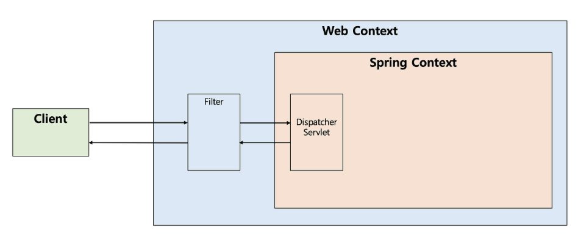
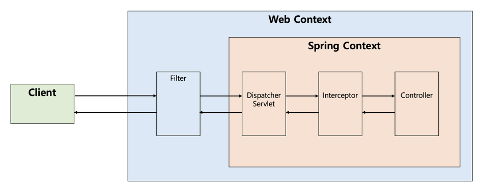
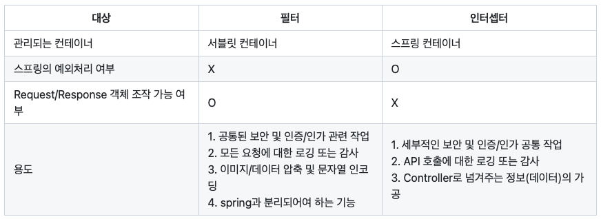

# 필터 (Filter)

필터는 J2EE 표준 스펙 기능으로 디스패처 서블릿에 요청이 전달되지 전/후에 \
url 패턴에 맞는 모든 요청에 대해 부가작업을 실행하는 기능을 제공한다. 

<div align='center'>
    
</div>

## 필터의 메서드
- init() : 필터 객체를 초기화 하고 서비스에 추가
- doFilter() : HTTP 요청이 디스패처 서블릿으로 전달되기 전/후에 동작하는 메서드 
- destory() : 필터 객체를 제거하고 자원을 반환

## 코드 구조
```java
public interface Filter {

    public default void init(FilterConfig filterConfig) throws ServletException {}

    public void doFilter(ServletRequest request, ServletResponse response,
            FilterChain chain) throws IOException, ServletException;

    public default void destroy() {}
}
```

# 인터셉터 (Interceptor)

인터셉터란 Spring에서 제공하는 기술로써 디스패처 서블릿이 컨트롤러를 호출하기 전과 후에 요청과 응답을 가능하는 기능을 제공한다.
즉, 필터는 웹 컨테이너에서 동작하지만 인터셉터는 스프링 컨텍스트에서 동작한다.

<div align='center'>
    
</div>

## 인터셉터의 메서드
- preHandle() : 컨트롤러를 호출하기 전에 실행, 전처리 작업등을 추가할 수 있다.
- postHandle() : 컨틀로러가 호출된 후에 실행, 후처리 작업등을 추가할 수 있다.
- afterCompletion() : 요청과 관련된 모든 작업이 마무리 된 후에 실행, 리소르르 반환할 때 사용

## 코드 구조
```java
public interface HandlerInterceptor {

    default boolean preHandle(HttpServletRequest request, HttpServletResponse response, Object handler)
        throws Exception {
        
        return true;
    }

    default void postHandle(HttpServletRequest request, HttpServletResponse response, Object handler,
        @Nullable ModelAndView modelAndView) throws Exception {
    }

    default void afterCompletion(HttpServletRequest request, HttpServletResponse response, Object handler,
        @Nullable Exception ex) throws Exception {
    }
}
```
> ### 인터셉터와 AOP 비교
> 인터셉터와 AOP는 그 기능이 유사하지만, 몇가지 차이에 따라 사용을 결정할 수 있다.
> 1. 컨트롤러는 시그니처가 제각각이기 대문에 포인트컷을 선별하기 어렵다.
> 2. 컨트롤러의 리턴 값은 일정하지 않다.


## 총정리
<div align='center'>
    
</div>