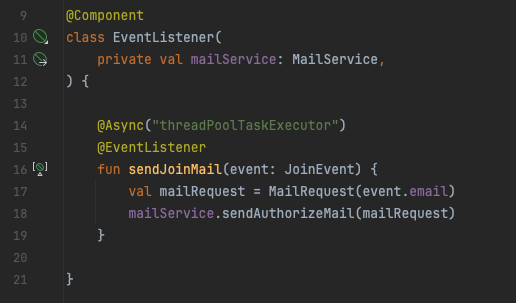

## Spring Event와 @Async를 통한 메일 전송 비동기 처리
### 문제 상황

- 회원가입과 메일 전송이 하나의 로직에 있어 사용자의 **대기 시간이 증가하는 문제** 발생
- 메일 전송에서 예외 발생시 **해당 트랜잭션이 전부 롤백** 되는 문제 발생

**a. 동기적 처리 방식**

- 회원가입 로직과 메일 전송 로직이 동기적으로 묶여 있는 문제
- 메일 전송은 외부 API를 사용하기 때문에 성능을 보장할 수 없는 문제

→ **모든 로직이 완료 될 때까지 대기 시간 상승**

**b. 트랜잭션**

- 회원 가입 로직은 하나의 트랜잭션 내에서 동작
- 외부 API를 사용하는 메일 전송에서 예외가 발생할 경우 전체 로직이 롤백 되어 회원가입까지 실패

→ **로직간의 결합도가 높다**

### 해결 방법

**a. Spring 이벤트 활용**

- 스프링에서 제공하는 ApplicationEventPublisher 인터페이스를 통해 이벤트 발행
- @EventListener 를 통해 발행된 이벤트 처리장소 분리

→ **회원 가입과 메일 전송 각각의 행동을 분리**

**b. 비동기 처리 활용**

- 이벤트를 활용해 행동을 분리 했지만, 발행된 이벤트가 끝나기 전까지 회원가입 완료가 되지 않는 문제
- @Async를 활용해 **비동기 처리**하여 회원가입이 메일 전송 완료를 기다리지 않아도 되도록 수정
- 만약 메일 전송이 실패하더라도 회원가입은 완료되고, 메일은 재 전송 가능

→ **제어하기 힘든 외부 API가 완료되지 않아도 회원 가입 처리 가능**

    

### 결과

- 회원 가입 완료 대기 시간 약 **5초 → 0.15초**로 단축
- 트랜잭션 전파 단계 관리가 필요한 경우 **@Transactional(value=Transactional.TxType.REQUIRES_NEW)** 를 통해서 별도의 트랜잭션으로 분리 가능