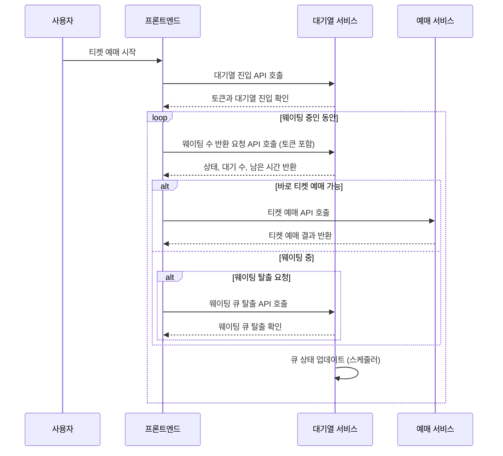

## Redis를 활용한 대기열 구현

### 문제 상황
- 수강신청의 경우 트래픽이 특정 시간대에 집중
- 예상치 못한 수준의 트래픽에 서버가 다운될 수도 있다고 판단
- 실제로 서버에 요청하는 트래픽의 수를 제한해서 트래픽 부하를 방지할 수 있다고 판단

### 해결 방법

- Redis의 Sorted Set (ZSet)을 활용해서 대기 큐와 처리 큐를 구현했습니다.
- 처리 큐의 사이즈를 제한하고, 그 이상의 사용자에 대해선 대기 큐에 순서대로 적제합니다.
- 일정 시간마다 처리 큐의 빈 공간을 찾아 대기 큐에서 순서대로 꺼내 넣어줍니다.

### 결과
- 실제 서비스에 요청을 하는 사용자를 1000명을 제한
- 집중적으로 몰리는 트래픽을 보다 안정적으로 처리가능해졌습니다.