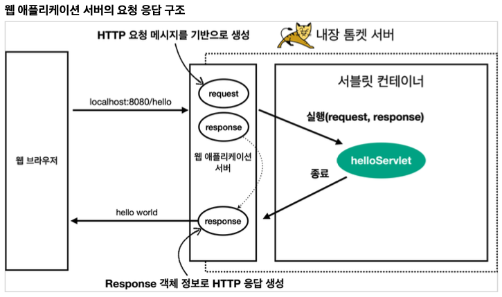

# 서블릿(Servlet) 이란?

서블릿(Servlet)이란 동적 웹 페이지를 만들 때 사용되는 자바 기반의 웹 애플리케이션 프로그래밍 기술이다. \
서블릿은 웹 요청과 응답의 흐름을 간단한 메서드 호출만으로 체계적으로 다룰 수 있게 해준다.

## Hello 서블릿
스프링 부트는 내장 톰캣 서버를 제공하므로 별도의 설치 없이 서블릿을 사용할 수 있다.

### `@ServletComponentScam`

> 스프링이 자동으로 내 패키지를 포함한 모든 하위패키지에 있는 서블릿을 찾아 자동으로 등록해주기 위해 @ServletComponentScan 어노테이션 추가

```
@ServletComponentScan // 서블릿 자동 등록
public class ServletApplication {

}
```

### `@WebServlet`

> 서블릿으로 등록하기 위하여 어노테이션 추가
> <br> name은 서블릿 이름, urlPatterns는 URL 매핑을 뜻한다.
>
> "/{urlPatterns}"이 호출되면, 서블릿 컨테이너는 해당 메서드를 실행한다.

HTTP 요청을 통해 매핑된 URL이 호출되면 서블릿 컨테이너는 다음 메서드를 실행한다.

```
@WebServlet(name = "helloServlet", urlPatterns = "/hello")
public class HelloServlet extends HttpSevlet {
    @Override
    protected void service(HttpServletRequest request,HttpServletResponse response) 
	throws ServletException, IOException {
        
        System.out.println("HelloServlet.service");
        System.out.println("request = " + request);
        System.out.println("response = " + response);
}
```

`HttpServletRequest`, `HttpServletResponse`는 인터페이스이다.
WAS 서버들이 Servlet 표준 스펙을 구현하는것 -> 구현체 존재, 찍히는 것은 구현체

## 서블릿 동작 과정

<div align='center'>
    
</div>

스프링 부트를 실행하면 내장 톰캣 서버를 띄워주고, \
서블릿 컨테이너를 통해 서블릿을 실행, HelloServlet이 생성됨

<div align='center'>
    
</div>

웹 브라우저와 HTTP request, response 를 주고 받는다.

<div align='center'>
    
</div>

서버는 request, response 객체를 만들어서 helloServlet을 호출해줌 거기에 서비스 메서드를 호출하면서 requset, response던져줌

그 후 서블릿이 종료되고 나가면서 WAS서버가 response정보를 가지고 HTTP 메세지를 만들어서 반환해줌

웹브라우저에서 볼 수 있음


## HttpServletRequest

HTTP 요청 메시지를 개발자가 직접 파싱해서 사용해도 되지만, 매우 불편할 것이다.\
서블릿은 개발자가 HTTP 요청 메시지를 편리하게 사용할 수 있도록 개발자 대신에 HTTP 요청 메시지를 파싱한다.\
그리고 그 결과를 `HttpServletRequest` 객체에 담아서 제공한다.

## HttpServletResponse
- HTTP 응답코드
- 지정 헤더 생성
- 바디 생성

### 참고자료
[스프링 MVC 1편 - 백엔드 웹 개발 핵심 기술](https://www.inflearn.com/course/%EC%8A%A4%ED%94%84%EB%A7%81-mvc-1/dashboard)
